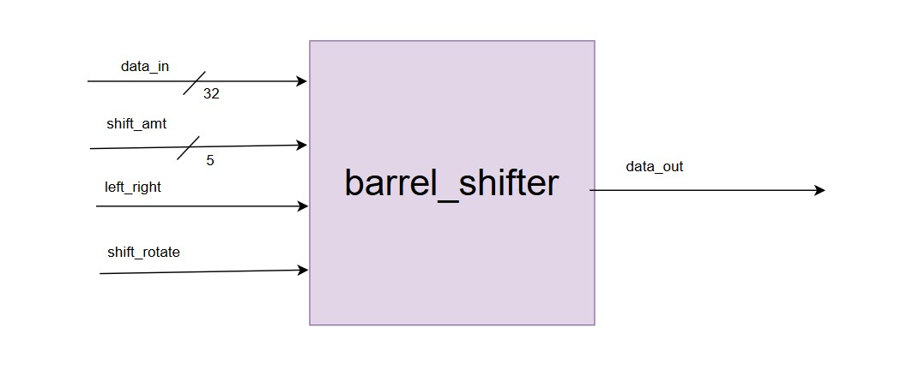

# 32-Bit Barrel Shifter  

## 4.1 Lab 2A: 32-bit Barrel Shifter 
#### Design Requirements 
● 32-bit data input/output 
● 5-bit shift amount (0-31 positions) 
● Direction control (left/right) 
● Mode control (shift/rotate) 
● Single cycle operation 
#### Design Methodology 
1. Draw the datapath showing all multiplexer stages 
2. Optimize multiplexer logic for minimum delay 
3. Consider FPGA routing resources

---

#### Overview  
This module implements a **32-bit barrel shifter**.  
It does both **shift** and **rotate** operations in **either left or right direction**.  
By using **bit reversal technique**, left shifts are internally handled as right shifts and then reversing is done.  

---

## Block Diagram  
  

---

### Operation Table  

| left_right | shift_rotate | Operation          | Description                          |  
|------------|--------------|-------------------|--------------------------------------|  
| 0          | 0            | Left Logical Shift| Shift left, fill with zeros          |  
| 0          | 1            | Left Rotate       | Shift left, wrap-around bits         |  
| 1          | 0            | Right Logical Shift| Shift right, fill with zeros        |  
| 1          | 1            | Right Rotate      | Shift right, wrap-around bits        |  

---
#### Logic   

1. **Bit Reversal:** Left shift/rotate is implemented by reversing input bits, applying right shift, then reversing back .so,this way,the same right-shift hardware can be reused for both left and right operations.
2. **Effective Input Selection:** The    
- If `left_right = 1` : Direct input (`data_in`) is used for right shift/rotate.  
- If `left_right = 0` : Reversed input is used for left shift/rotate.  
3. **Stage-Wise Shifting:** Each bit of `shift_amt` controls a stage (1, 2, 4, 8, or 16-bit shifts). 
e-g if we want to shift by 3, then stage0 and stage1 would be done 1 bit and 2 bits shift respectively. 
4. **Stage Wise Shifting**  
- Each bit of the  `shift_amt` i-e 5 bits represents a stage:  
     - `shift_amt[0]` : Shift/rotate by 1 bit  
     - `shift_amt[1]` : Shift/rotate by 2 bits  
     - `shift_amt[2]` : Shift/rotate by 4 bits  
     - `shift_amt[3]` : Shift/rotate by 8 bits  
     - `shift_amt[4]` : Shift/rotate by 16 bits  
- This allows shifting/rotating by any value from **0–31 bits** in just one cycle.  
4. **Shift vs Rotate Selection:**  
- If `shift_rotate = 0` then ,zeros are inserted i-e the normal shift.  
- If `shift_rotate = 1` then,bits wrap aroundi-e circular rotation.  
5. **Final Output Selection:** If left shift is selected, reversed output is used; else,the direct shifted result is taken.  
---
#### Example Run:

Right Logical Shift  
data_in = 00000000_00000000_00000000_10101010
shift_amt = 00010 (2)
left_right = 1 (Right)
shift_rotate= 0 (Logical Shift)

Output:
data_out = 00000000_00000000_00000000_00101010
 

Left Rotate  
data_in = 10000000_00000000_00000000_00000001
shift_amt = 00001 (1)
left_right = 0 (Left)
shift_rotate= 1 (Rotate)

Output: 
data_out = 00000000_00000000_00000000_00000011

---

#### Sources Used
- Used AI to understand the logic behind barrel_shifter.
- Youtube

---

#### Simulation  
  