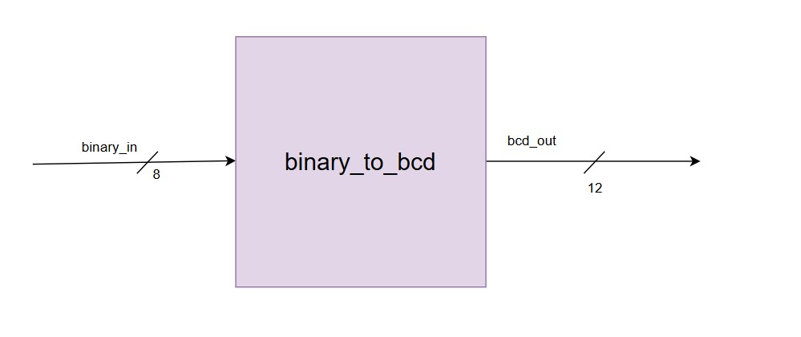
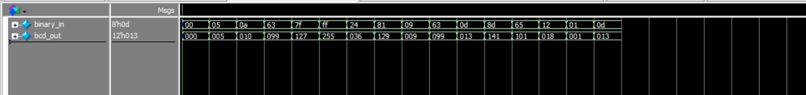

# 4.2 Lab 2B: Binary Coded Decimal (BCD) Converter 
#### Design Requirements 
● Convert 8-bit binary to 3-digit BCD 
● Purely combinational implementation 
● Input range: 0-255, Output: 000-255 in BCD 
#### Algorithm Understanding 
1. Study Double-Dabble algorithm 
2. Trace through examples on paper 

---

#### Overview  
This module converts an 8-bit binary input`0–255` into a **3-digit BCD** (Binary-Coded Decimal) output.  
The output is composed of :  
- `[11:8]` : Hundreds digit  
- `[7:4]`  : Tens digit  
- `[3:0]`  : Units digit  

The conversion is performed using the **Double Dabble Algorithm**.  

---

#### Block Diagram

#### Logic 

1. **Shift Register**  
   - A 20-bit register is created for :  
     - `[19:16]` : Hundreds BCD digit  
     - `[15:12]` : Tens BCD digit  
     - `[11:8]`  : Units BCD digit   
     and 
     - `[7:0]`   : Original binary input  
   - Initialized as `{8'b0, binary_in}`  

2. **Double Dabble Algorithm**  
   - For each of the 8 binary input bits:  
     - If any BCD digit ≥ 5, add 3 to that digit (correction step).  
     - Left shift the entire register by 1 (`{bcd, binary} << 1`).  

3. **Final Result**  
   - After 8 iterations, the **BCD digits** are available in `[19:8]` and so assigned to `bcd_out`.  

---
#### Working of Double Dabble Algorithm

---

#### Example Run

Input: 
binary_in = 8'b01100100 this is 100 in decimal.
Output:
bcd_out = 12'b0001_0000_0000
Here,
Hundreds=1, Tens=0, Units=0.
 
Input:
binary_in = 8'b11111001 this is 249 in decimal.

Output: 
bcd_out = 12'b0010_0100_1001
Here,
Hundreds=2, Tens=4, Units=9.

---

#### Simulation
