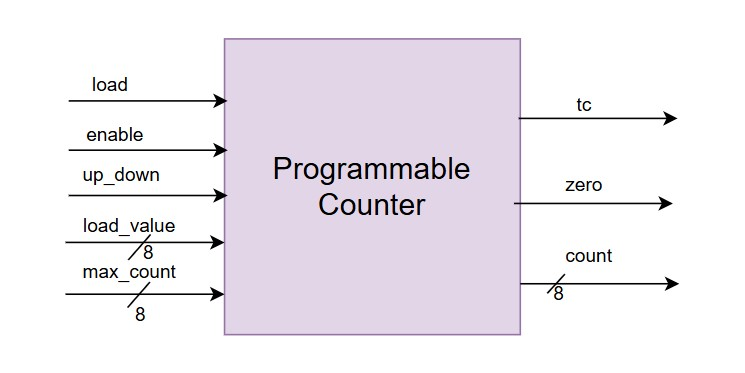
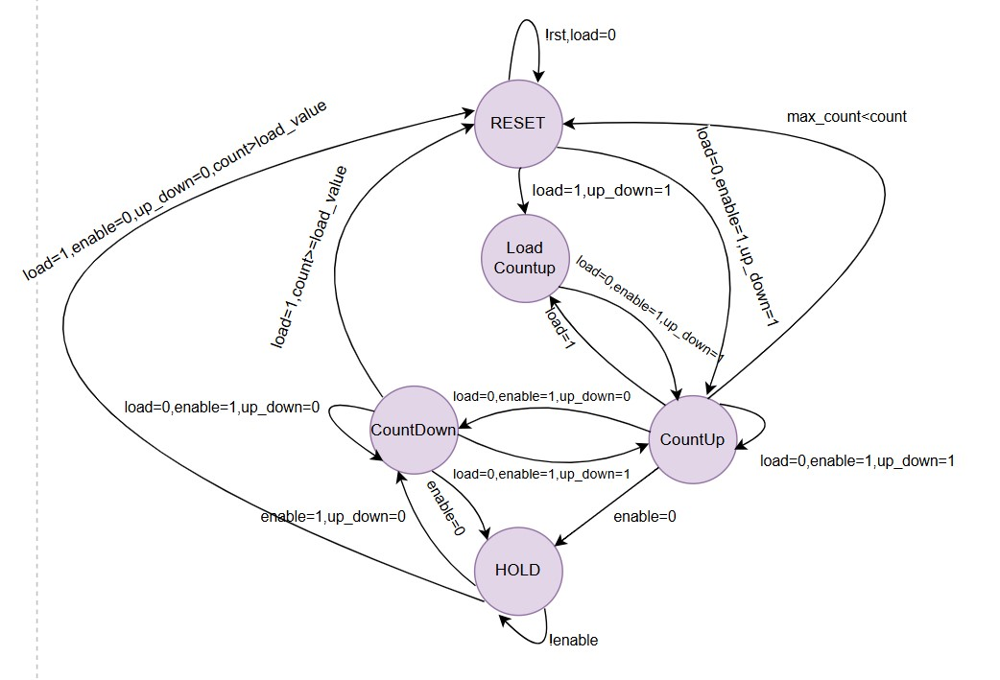
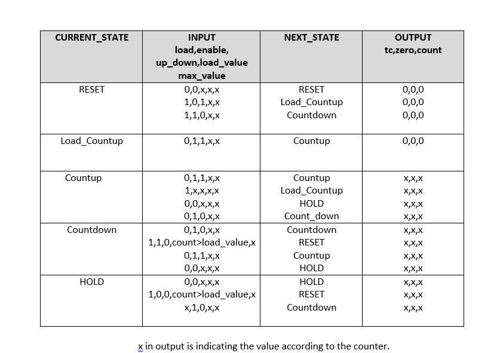
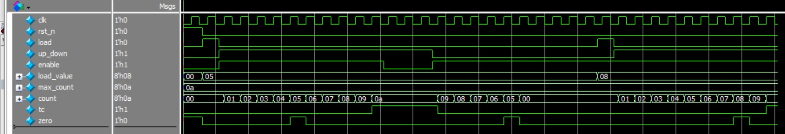

# 5.1 Lab 3A: Programmable Counter 
#### Design Requirements 
● 8-bit up/down counter with programmable limits 
● Control inputs: load, enable, up/down, reset 
● Status outputs: terminal count, zero detect 
● Synchronous operation with proper reset 
#### Design Methodology 
1. Draw state diagram showing all counter states 
2. Define control logic for each input combination 
3. Plan reset strategy (synchronous vs asynchronous) 
4. Consider metastability for control inputs
 
#### Overview  
This module implements a **programmable up/down counter** with load capability, terminal count detection, and zero detection.  
It supports both counting up and down, with control signals for loading and enabling operations.

---
#### Block Diagram

---

### Programmable Counter FSM

---

### Programmable Counter Table

---

#### Features  
- Programmable Load (`load_value`)  
- Up/Down Control (`up_down`)  
- Enable/Disable counting (`enable`)  
- Terminal Count flag (`tc`)  
- Zero flag (`zero`)  

---

#### Interface  

| Signal       | Direction | Width | Description                              |
|--------------|-----------|-------|------------------------------------------|
| `clk`        | Input     | 1     | Clock signal                             |
| `rst_n`      | Input     | 1     | Asynchronous reset (active low)          |
| `load`       | Input     | 1     | 1 = Load mode, 0 = Count mode            |
| `up_down`    | Input     | 1     | 1 = Up counter, 0 = Down counter         |
| `enable`     | Input     | 1     | Enable counting                          |
| `load_value` | Input     | 8     | Value to load when `load=1`              |
| `max_count`  | Input     | 8     | Maximum count value for up counting      |
| `count`      | Output    | 8     | Current counter value                    |
| `tc`         | Output    | 1     | Terminal count flag (`count == max_count`) |
| `zero`       | Output    | 1     | Zero flag (`count == 0`)                 |

---
##### Outputs  
| Signal  | Width | Description |
|---------|-------|-------------|
| `count` | 8     | Current counter value |
| `tc`    | 1     | High when `count == max_count` |
| `zero`  | 1     | High when `count == 0` |

---

#### Operation  
- **Load Mode (`load = 1`)** : Loads `load_value` into counter.  
- **Count Up (`up_down = 1`)** :Increments `count` until `max_count`, then wraps/reset.  
- **Count Down (`up_down = 0`)** : Decrements `count` until zero.  
- **Hold (`enable = 0`)** : Counter value remains constant.  
### Simulation

---
