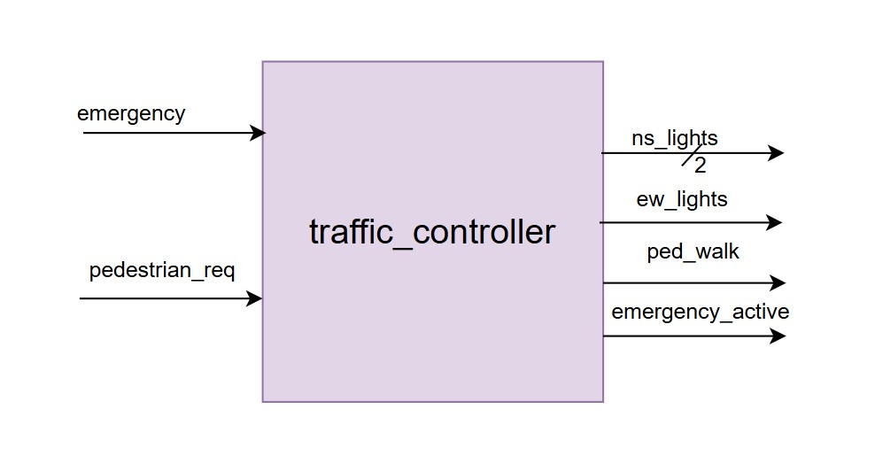
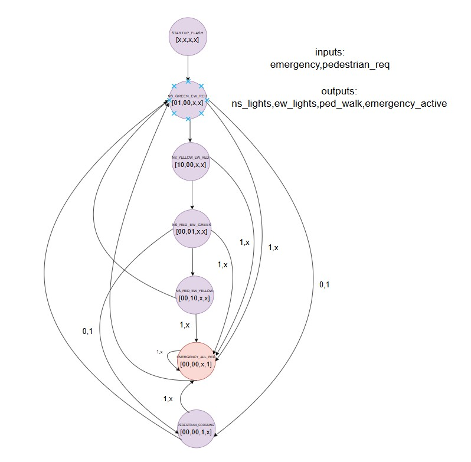
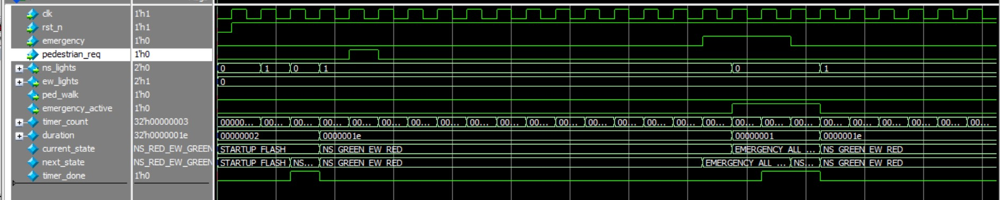

# Digital Design Lab 01 – ALU & Priority Encoder

This repository contains SystemVerilog implementations for  fundamental digital design components:

1. **8-bit Arithmetic Logic Unit (ALU)**
2. **8-to-3 Priority Encoder with Enable**

---

##  Lab 1A: 8-bit ALU

###  Design Requirements
- 8-bit ALU supporting the following operations:
  - ADD (`000`)
  - SUB (`001`)
  - AND (`010`)
  - OR  (`011`)
  - XOR (`100`)
  - NOT (`101`)
  - Shift Left Logical (SLL, `110`)
  - Shift Right Logical (SRL, `111`)
- 3-bit operation select (`op_sel`)
- Status outputs:
  - **Zero** flag
  - **Carry** flag (for unsigned arithmetic)
  - **Overflow** flag (for signed arithmetic)
- Optimized for FPGA implementation

###  Design Steps
1. Create truth table for all 8 operations.
2. Draw block diagram showing datapath.
3. Implement add/subtract logic with carry/overflow detection.
4. Add logical and shift operations.
5. Verify design through simulation testbench.
6. Consider FPGA resource utilization.
## Overview  
This module implements an 8-bit ALU in SystemVerilog supporting arithmetic, logical, and shift operations.  
The ALU provides flags for zero, carry, and signed overflow detection.  
It supports addition, subtraction, AND, OR, XOR, NOT, and single-bit left/right shifts.  

##  Block Diagram

###  Operation Table

## Simulation

---
##  Lab 1B: Priority Encoder

###  Design Requirements
- **8-to-3 Priority Encoder** with input enable
- Inputs: Active-high (`I7` highest priority → `I0` lowest)
- Outputs:
  - `Y2, Y1, Y0` (3-bit binary code)
  - `Valid` signal (asserted when any input = 1)
- Must handle **all-zero input case**

###  Design Steps
1. Construct truth table for all 8 inputs.
2. Use K-map simplification to derive optimized equations.
3. Implement priority logic ensuring highest index has priority.
4. Add `Valid` output for all-zero detection.
5. Verify design using testbench.
### Overview
This module implements an 8-to-3 priority encoder with enable control.  
It encodes the highest-priority active input bit (bit7 highest, bit0 lowest) into a 3-bit binary output.  
The `valid` signal indicates whether any input bit is active when enable is asserted.  

###  Optimized Output Equations
From K-map minimization:
Y2 = I7 + I6 + I5 + I4
Y1 = I7 + I6 + I3 + I2
Y0 = I7 + I5 + I3 + I1

### Truth Table

### Block Diagram

### Simulation

---
## 4. Lab 2: Advanced Combinational Logic 
### 4.1 Lab 2A: 32-bit Barrel Shifter 
### Design Requirements 
● 32-bit data input/output 
● 5-bit shift amount (0-31 positions) 
● Direction control (left/right) 
● Mode control (shift/rotate) 
● Single cycle operation 
### Design Methodology 
1. Draw the datapath showing all multiplexer stages 
2. Optimize multiplexer logic for minimum delay 
3. Consider FPGA routing resources
### Overview 
This module performs 32-bit left/right shifts and rotates with a configurable shift amount.  
It supports logical shifts (zero fill) and rotates (bit wrap-around).  
Direction (`left_right`) and mode (`shift_rotate`) control the operation, making it versatile for ALU designs.  
#### Operations
| Operation | Description |
|-----------|-------------|
| Left Shift  | Shifts bits left and fills with zeros |
| Right Shift | Shifts bits right and fills with zeros |
| Left Rotate | Rotates bits left with wrap-around    |
| Right Rotate| Rotates bits right with wrap-around   |
### Block Diagram

### Simulation

---
### 4.2 Lab 2B: Binary Coded Decimal (BCD) Converter 
### Design Requirements 
● Convert 8-bit binary to 3-digit BCD 
● Purely combinational implementation 
● Input range: 0-255, Output: 000-255 in BCD 
### Algorithm Understanding 
1. Study Double-Dabble algorithm 
2. Trace through examples on paper
### Overview
This module converts an 8-bit binary number (0–255) into its 3-digit BCD representation.  
It uses the **Double-Dabble algorithm** (shift-and-add-3) for efficient binary-to-decimal conversion.  
The output provides three packed BCD digits: hundreds, tens, and units.  

#### BCD Output Format
| Bits   | Digit     |
|--------|-----------|
| [11:8] | Hundreds  |
| [7:4]  | Tens      |
| [3:0]  | Units     |

### Block Diagram

### Simulation

---

## 5. Lab 3: Sequential Circuit Fundamentals
### 5.1 Lab 3A: Programmable Counter 
### Design Requirements 
● 8-bit up/down counter with programmable limits 
● Control inputs: load, enable, up/down, reset 
● Status outputs: terminal count, zero detect 
● Synchronous operation with proper reset 
### Design Methodology 
1. Draw state diagram showing all counter states 
2. Define control logic for each input combination 
3. Plan reset strategy (synchronous vs asynchronous) 
4. Consider metastability for control inputs
 
### Overview  
This module implements a **programmable up/down counter** with load capability, terminal count detection, and zero detection.  
It supports both counting up and down, with control signals for loading and enabling operations.

---
### Block Diagram

### Programmable Counter Table

### Programmable Counter FSM

---

#### Features  
- Programmable Load (`load_value`)  
- Up/Down Control (`up_down`)  
- Enable/Disable counting (`enable`)  
- Terminal Count flag (`tc`)  
- Zero flag (`zero`)  

---

#### Interface  

| Signal       | Direction | Width | Description                              |
|--------------|-----------|-------|------------------------------------------|
| `clk`        | Input     | 1     | Clock signal                             |
| `rst_n`      | Input     | 1     | Asynchronous reset (active low)          |
| `load`       | Input     | 1     | 1 = Load mode, 0 = Count mode            |
| `up_down`    | Input     | 1     | 1 = Up counter, 0 = Down counter         |
| `enable`     | Input     | 1     | Enable counting                          |
| `load_value` | Input     | 8     | Value to load when `load=1`              |
| `max_count`  | Input     | 8     | Maximum count value for up counting      |
| `count`      | Output    | 8     | Current counter value                    |
| `tc`         | Output    | 1     | Terminal count flag (`count == max_count`) |
| `zero`       | Output    | 1     | Zero flag (`count == 0`)                 |

---
##### Outputs  
| Signal  | Width | Description |
|---------|-------|-------------|
| `count` | 8     | Current counter value |
| `tc`    | 1     | High when `count == max_count` |
| `zero`  | 1     | High when `count == 0` |

---

#### Operation  
- **Load Mode (`load = 1`)** → Loads `load_value` into counter.  
- **Count Up (`up_down = 1`)** → Increments `count` until `max_count`, then wraps/reset.  
- **Count Down (`up_down = 0`)** → Decrements `count` until zero.  
- **Hold (`enable = 0`)** → Counter value remains constant.  
### Simulation

---

## 6.2 Lab 4A: Traffic Light Controller
 
### Overview
This fsm manages North-South (NS) and East-West (EW) traffic lights, pedestrian signals, and handles emergency overrides.  
The controller ensures safe traffic flow with proper timing for **green, yellow, red lights**, and **pedestrian walk requests**.

---
### Block Diagram

### FSM

 
 --- 
 
#### Features
- Startup flashing sequence on reset.
- Normal traffic cycle with green, yellow, and red phases.
- Pedestrian crossing mode with dedicated walk time.
- Emergency override mode (all lights turn red, emergency flag active).
- Timer-based state transitions for accurate durations.

---

#### FSM States
1. **STARTUP_FLASH** → Initial blinking mode for safety on reset.  
2. **NS_GREEN_EW_RED** → North-South traffic moves, East-West stops.  
3. **NS_YELLOW_EW_RED** → Transition from NS green to red.  
4. **NS_RED_EW_GREEN** → East-West traffic moves, North-South stops.  
5. **NS_RED_EW_YELLOW** → Transition from EW green to red.  
6. **PEDESTRIAN_CROSSING** → Pedestrian walk signal active, all traffic stopped.  
7. **EMERGENCY_ALL_RED** → Emergency mode, all signals red.  

---
### Assumptions

##### Pedestrian request:
Whenever pedestrian_req is asserted, the controller allows the current state’s duration to complete first, and only then transitions to the PEDESTRIAN_CROSSING state.

##### Emergency override:
An emergency overrides all states immediately. After the emergency condition is cleared, the controller resumes normal operation starting from the NS_GREEN_EW_RED state.

#### Parameters / Durations
| State                 | Duration (seconds) |
|------------------------|--------------------|
| STARTUP_FLASH          | 2  |
| N       | 30 |
| NS_YELLOW_EW_RED       | 5  |
| NS_RED_EW_GREEN        | 30 |
| NS_RED_EW_YELLOW       | 5  |
| PEDESTRIAN_CROSSING    | 10 |
| EMERGENCY_ALL_RED      | 1  |

---

#### Interface (I/O)
| Signal            | Direction | Description                                |
|-------------------|-----------|--------------------------------------------|
| `clk`             | Input     | System clock (1 Hz)                        |
| `rst_n`           | Input     | Active-low reset                           |
| `emergency`       | Input     | Emergency override request                 |
| `pedestrian_req`  | Input     | Pedestrian crossing request                |
| `ns_lights[1:0]`  | Output    | NS lights: `00=Red`, `01=Green`, `10=Yellow` |
| `ew_lights[1:0]`  | Output    | EW lights: same encoding as NS             |
| `ped_walk`        | Output    | Pedestrian walk signal                     |
| `emergency_active`| Output    | Indicates emergency mode is active         |

 
---
### Simulation

Even when ped_req was asserted, the NS_GREEN_EW_RED state continued until its duration was completed. However, when emergency was asserted, it immediately overrode the NS_GREEN_EW_RED state.

---

## 6.3 Lab 4B: Vending Machine Controller 
### Specification 
● Accepts 5, 10, 25 cent coins 
● Dispenses 30-cent item 
● Provides correct change 
● Handles coin return request 
● LED display for current amount 
### Design Methodology
1. List all possible states based on money inserted (0¢, 5¢, 10¢, 15¢, 20¢, 25¢, 30¢+) 
2. Draw state transitions for each coin input 
3. Plan change-making logic (what coins to return?) 
4. Handle error conditions (coin jam, exact change only)
### Block Diagram

 
#### Overview
The **Vending Machine Controller**  FSM-based design , simulates a vending machine.  
It accepts coins, tracks the balance, and dispenses a product once the required amount is reached.  
If excess coins are inserted, it returns the change.

---
### Vending Machine Table

### Vending Machine FSM

---

#### Interface (I/O)
| Signal        | Direction | Description                              |
|---------------|-----------|------------------------------------------|
| `clk`         | Input     | System clock                             |
| `reset`       | Input     | Active-high reset                        |
| `coin_in`     | Input     | Inserted coin (encoded value)            |
| `dispense`    | Output    | Signal to dispense product               |
| `change_out`  | Output    | Returned change amount                   |
| `balance`     | Output    | Current balance (for monitoring/debug)   |

---

#### Features
- Accepts multiple coin denominations (e.g., 5, 10, 25 units).
- Accumulates balance until product price is reached.
- Dispenses product automatically once enough balance is collected.
- Returns change when extra coins are inserted.
 

---

#### FSM States
1. **IDLE** → Waiting for coin input.  
2. **ACCUMULATE** → Adding coin value to balance.  
3. **DISPENSE** → Dispense product when balance ≥ price.  
4. **CHANGE** → Return excess amount (if any).  

---

#### Parameters
- `PRODUCT_PRICE` → Price of one product.  
- `COIN_VALUES` → Accepted coin denominations.  
- `MAX_BALANCE` → Maximum supported balance.  

---

### Simulation

It can be see that when user demands return we move to idle state after returning,else we move to the coin states and whenever we've >=30 ,we always dispense item worth 30 and return change or move to some other state based on money left and user change in return demand.

### Special Case: 
#### If the user presses coin_return in COIN_20 state.
The FSM then moves to COIN_10 to return a 10-cent coin and return_mode is set.So,  
When in transits to COIN_10 with return_mode=1 in next cycle, the FSM directly transitions back to IDLE,this way return of 20 is handled.

---

## 7. Lab 5: Counters and Timers 
### 7.1 Lab 5A: Multi-Mode Timer 
### Specification 
● 32-bit programmable timer with multiple modes: 
○ One-shot: Count down once and stop 
○ Periodic: Reload and restart automatically 
○ PWM: Generate PWM with programmable duty cycle 
● 1 MHz input clock, programmable prescaler 
● Interrupt generation capability 
### Design Approach 
1. Design prescaler for clock division 
2. Plan mode control logic 
3. Design reload mechanism 
4. PWM duty cycle calculation 

### Overview
This module implements a **32-bit programmable timer** with support for multiple modes:
- **One-shot mode (01):** Counts down once from the reload value to zero, then stops.
- **Periodic mode (10):** Automatically reloads the counter after reaching zero, creating a periodic timeout.
- **PWM mode (11):** Generates a Pulse Width Modulated (PWM) signal with programmable duty cycle using `reload_val` and `compare_val`.
- **Off mode (00):** Timer is disabled.

### Block Diagram

### Additional features:
- Programmable **prescaler** for input clock division (from 1 MHz system clock).
- Generates **timeout pulses** for event signaling or interrupt requests.
- Exposes **current counter value** for debugging/monitoring.

---

### Interface Ports

| Port Name      | Direction | Width   | Description |
|----------------|-----------|---------|-------------|
| `clk`          | Input     | 1       | System clock (1 MHz). |
| `rst_n`        | Input     | 1       | Active-low reset. |
| `mode`         | Input     | 2       | Timer mode selection:   `00=OFF`, `01=ONE_SHOT`, `10=PERIODIC`, `11=PWM`. |
| `prescaler`    | Input     | 16      | Clock divider value (timer ticks every `prescaler` cycles). |
| `reload_val`   | Input     | 32      | Initial counter value to load. |
| `compare_val`  | Input     | 32      | Duty cycle threshold for PWM mode. |
| `start`        | Input     | 1       | Start signal (edge-triggered). |
| `pwm_out`      | Output    | 1       | PWM waveform output. |
| `timeout`      | Output    | 1       | Timeout pulse (1-cycle pulse when counter reaches zero). |
| `current_count`| Output    | 32      | Current counter value. |

---

### Design Approach

1. **Prescaler Design**  
   - A 16-bit prescaler divides the input clock.  
   - Timer counter decrements once every `prescaler` cycles.  

2. **Mode Control Logic**  
   - **OFF:** Timer disabled, no counting.  
   - **ONE_SHOT:** Counts down to zero once, then stops (`running=0`).  
   - **PERIODIC:** Reloads counter after reaching zero, continuous operation.  
   - **PWM:** Reloads counter at zero, and compares against `compare_val` to generate PWM duty cycle.  

3. **Reload Mechanism**  
   - On `start` pulse: counter loads `reload_val`.  
   - On timeout in periodic/PWM mode: counter reloads automatically.  

4. **PWM Duty Cycle Generation**  
   - `pwm_out = 1` when `count > compare_val`.  
   - Duty cycle = `(reload_val - compare_val) / reload_val`.  

5. **Timeout Handling**  
   - When counter reaches zero, `timeout` pulses high for one cycle.  
   - Useful for **interrupt requests** in a system.  

---

### Operations
- On reset, timer clears everything.  
- On `start` pulse: counter loads `reload_val` and begins counting.  
- Prescaler ensures counting speed is configurable.  
- When counter reaches zero:
  - **One-shot:** Stops.  
  - **Periodic:** Reloads and continues.  
  - **PWM:** Reloads and generates waveform based on `compare_val`.  
- Timeout pulse signals events or triggers interrupts. 

### Simulation

#### One Shot

### Periodic Timer

### Pwm

---
 
## 8. Lab 6: Memory Interfaces 
### 8.1 Lab 6A: Synchronous SRAM Controller 
### Specification 
● Interface to 32Kx16 synchronous SRAM 
● Single-cycle read/write operation 
● Address and data buses with proper timing 
● Chip enable and output enable control 
### Interface Timing Analysis 
1. Study SRAM datasheet timing requirements 
2. Draw timing diagrams for read and write cycles 
3. Calculate setup/hold times relative to clock 
4. Plan address/data multiplexing 
### SRAM FSM

#### SRAM Controller

This module implements a **simple synchronous SRAM controller** using a finite state machine (FSM).  
It supports **read** and **write** operations with a ready/acknowledge signal to the user.  
The design interfaces with a standard asynchronous SRAM chip using bidirectional data lines.

---
 

## Features
- Supports both **read** and **write** requests.
- FSM-based control with 4 states:
  - `IDLE`
  - `WRITE`
  - `READ`
  - `READ_WAIT`
- Handles **bidirectional data bus (`sram_data`)** correctly.
- Generates `ready` signal once the transaction is complete.
- Ensures proper SRAM timing by waiting one cycle for read data.

---

## Port Description

| Signal        | Direction | Width  | Description                              |
|---------------|-----------|--------|------------------------------------------|
| `clk`         | Input     | 1 bit  | System clock                             |
| `rst_n`       | Input     | 1 bit  | Active-low reset                         |
| `read_req`    | Input     | 1 bit  | Read request                             |
| `write_req`   | Input     | 1 bit  | Write request                            |
| `address`     | Input     | 15 bit | SRAM address                             |
| `write_data`  | Input     | 16 bit | Data to be written to SRAM               |
| `read_data`   | Output    | 16 bit | Data read from SRAM                      |
| `ready`       | Output    | 1 bit  | Signals completion of read/write         |
| `sram_addr`   | Output    | 15 bit | Address line to SRAM                     |
| `sram_data`   | Inout     | 16 bit | Bidirectional data bus                   |
| `sram_ce_n`   | Output    | 1 bit  | SRAM chip enable (active low)            |
| `sram_oe_n`   | Output    | 1 bit  | SRAM output enable (active low)          |
| `sram_we_n`   | Output    | 1 bit  | SRAM write enable (active low)           |

---

## FSM States

### 1. `IDLE`
- Default state after reset.
- `ready = 0`.
- Waits for either:
  - `write_req = 1` → move to **WRITE**
  - `read_req = 1` → move to **READ**

---

### 2. `WRITE`
- Asserts:
  - `sram_ce_n = 0`
  - `sram_we_n = 0`
- Drives `write_data` on `sram_data`.
- After one cycle:
  - Completes write
  - Releases bus
  - `ready = 1`
- Next state → **IDLE**

---

### 3. `READ`
- Asserts:
  - `sram_ce_n = 0`
  - `sram_oe_n = 0`
- Releases `sram_data` bus (set to `Z`).
- Waits one cycle for data to be valid.
- Next state → **READ_WAIT**

---

### 4. `READ_WAIT`
- Captures valid data from `sram_data` into `read_data`.
- Deasserts `sram_oe_n` and `sram_ce_n`.
- `ready = 1`
- Next state → **IDLE**

---

### Simulation Waveform

---

#### Notes
- `sram_data` is driven only during **write**; otherwise, it is high-impedance (`'z`).  
- `read_data` is latched during the **READ** state.  
- The FSM returns to `IDLE` after every operation.  

--- 
## 9. Lab 7: FIFO Design 
### 9.1 Synchronous FIFO 
### Specification 
● Parameterizable width and depth 
● Full/empty flag generation 
● Almost-full/almost-empty thresholds 
● Efficient FPGA block RAM utilization 
### Design Methodology 
1. Choose pointer width (binary vs Gray code) 
2. Design flag generation logic 
3. Plan memory instantiation (inferred vs explicit) 
4. Optimize for timing and resource usage 
Key Design Decisions 
● Binary counters with comparison logic vs Gray code counters 
● Registered vs combinational output flags 
● Power-of-2 vs arbitrary depth handling 
 
 ###  Key Design Decisions
- **Counters**: Binary counters with comparison logic used here.  
- **Flags**: Registered outputs for stability.  
- **Depth**: Power-of-2 is simplest, but design can handle arbitrary depths. 
##### Synchronous FIFO

This module implements a **synchronous FIFO** with a single clock domain (`clk`).  
It supports configurable **data width and depth**, along with `full`, `empty`, `almost_full`, and `almost_empty` flags.  
A **counter (`count`)** tracks the number of stored entries, enabling precise flow control.  
Circular buffer logic (`wr_ptr`, `rd_ptr`) manages writes and reads, ensuring reliable FIFO operation.  

#### Asynchronous FIFO

This module implements an **asynchronous FIFO** with independent write (`wr_clk`) and read (`rd_clk`) clock domains.  
It uses **Gray code pointers** with synchronizers to safely transfer read/write pointers across clock domains.  
The FIFO supports configurable **data width and depth**, with proper `full` and `empty` flag generation.  
It ensures reliable **data transfer between unrelated clock domains** without metastability issues.  

 
---

#### Parameters

| Name                  | Description                                        | Default     |
|-----------------------|----------------------------------------------------|-------------|
| `DATA_WIDTH`          | Width of data bus                                  | 16          |
| `FIFO_DEPTH`          | Depth of FIFO (number of entries)                  | 8           |
| `ALMOST_FULL_THRESH`  | Threshold for asserting `almost_full`              | FIFO_DEPTH-2|
| `ALMOST_EMPTY_THRESH` | Threshold for asserting `almost_empty`             | 2           |

---

#### Ports

#### Inputs
- `clk` : System clock.  
- `reset` : Active-high reset.  
- `wr_en` : Write enable (write data when `!full`).  
- `rd_en` : Read enable (read data when `!empty`).  
- `data_in [DATA_WIDTH-1:0]` : Input data to be written into FIFO.  

#### Outputs
- `data_out [DATA_WIDTH-1:0]` : Output data read from FIFO.  
- `full` : Asserted when FIFO is completely filled.  
- `empty` : Asserted when FIFO is completely empty.  
- `almost_full` : Asserted when number of entries ≥ `ALMOST_FULL_THRESH`.  
- `almost_empty` : Asserted when number of entries ≤ `ALMOST_EMPTY_THRESH`.  
- `count [$clog2(FIFO_DEPTH+1)-1:0]` : Current number of stored entries.  

---

#### Operation

- **Write**:  
  If `wr_en = 1` and `full = 0`, data from `data_in` is written into FIFO.  

- **Read**:  
  If `rd_en = 1` and `empty = 0`, data is read from FIFO to `data_out`.  

- **Flags**:  
  - `full` → No more writes possible.  
  - `empty` → No more reads possible.  
  - `almost_full` → FIFO close to full (useful for flow control).  
  - `almost_empty` → FIFO close to empty (useful for prefetching).  

---
### Simulation
### Synchronous Fifo

### Asynchronous Fifo

 
## 10. Lab 8: UART Controller 
### 10.1 UART Transmitter 
### Specification 
● Configurable baud rate (9600, 19200, 38400, 115200) 
● 8-bit data, 1 start bit, 1 stop bit, optional parity 
● Transmit FIFO with configurable depth 
● Status flags: busy, FIFO full/empty 
### Design Steps 
1. Calculate baud rate generation - create timing diagram 
2. Draw UART frame format 
3. Design transmit state machine 
4. Integrate with FIFO 
### Baud Rate Generator Calculation

The **baud rate generator** produces a timing pulse (`baud_tick`) so that the UART can transmit and receive bits at the correct rate.

### Formula

To generate the baud rate clock from the system clock:

\[
N = \frac{f_{clk}}{2*f_{baud}}
\]

Where:  
- \( f_{clk} \) = System clock frequency (Hz)  
- \( f_{baud} \) = Desired baud rate (bits per second)  
- \( N \) = Divider value (number of system clock cycles per baud tick)

---
### Uart Frame Format

---
### Transmitter FSM's
#### Transmitter Fifo Fsm

#### Transmitter ShiftRegister Fifo Fsm

### UART Transmitter Module

This module implements a **UART transmitter** with a FIFO buffer and shift register, supporting configurable baud rate and system clock.

#### Features
- FIFO buffer with configurable depth to queue bytes for transmission.
- Shift register transmits **start bit, 8 data bits, and stop bit** serially.
- Baud rate generator produces `baud_tick` to control timing of transmission.
- Signals for flow control: `tx_ready`, `tx_busy`, `tx_valid`.

#### Inputs
- `clk` : System clock  
- `rst_n` : Active-low reset  
- `tx_data` : 8-bit data byte to transmit  
- `tx_valid` : Pulse to write data into FIFO  

#### Outputs
- `tx_ready` : High when FIFO can accept more data  
- `tx_serial` : Serial output line for UART transmission  
- `baud_tick` : Tick signal from baud rate generator  
- `tx_busy` : High when transmitter is busy sending data  

#### Internal Blocks
1. **Baud Rate Generator** (`baud`)  
   - Generates `baud_tick` for timing shift register and FIFO operations.
2. **FIFO**  
   - Stores bytes to be transmitted.
   - Signals: `f_full`, `f_empty`.
3. **FIFO Controller** (`fifo_controller`)  
   - Controls FIFO read/write based on `tx_valid` and `tx_ready`.
4. **Shift Register** (`shiftRegister`)  
   - Serializes 8-bit data with start and stop bits.
   - Controlled by signals `s_load` and `s_shift`.
5. **Shift Register Controller** (`shiftreg_controller`)  
   - Generates shift/load signals and indicates when transmission is done.
6. **Busy Logic**  
   - `tx_busy` is high when FIFO has data or shift register is not empty.

#### Timing Notes
- Each byte is transmitted **one start bit + 8 data bits + stop bit**.
- Transmission occurs on **baud_tick edges**.
- FIFO ensures smooth transmission without data loss.

#### Transmitter Simulation

---

### Receiver FSM

### UART Receiver Module

This module implements a **UART receiver** with a FIFO buffer and oversampled shift register, supporting configurable baud rate and system clock.

#### Features
- **Oversampling**: Uses a 16× baud clock (`baud16_clk`) for reliable sampling.
- **FIFO buffer**: Stores received bytes to prevent data loss.
- **Framing error detection**: Checks stop bit validity.

#### Inputs
- `clk` : System clock  
- `rst` : Active-high reset  
- `rx_serial` : Incoming UART serial line  
- `rx_ready` : Processor request to read a received byte  

#### Outputs
- `rx_data` : 8-bit received data  
- `rx_valid` : High when a byte is available in FIFO  
- `frame_error` : High if stop bit is invalid  
- `baud_clk` : Continuous baud clock  

#### Internal Blocks
1. **Baud Generators**
   - `baud16`: Generates 16× oversampling clock (`baud16_clk`) for precise mid-bit sampling.
   - `baud`: Generates standard baud clock (`baud_clk`) for FIFO and controller timing.
2. **Shift Register**
   - Samples serial input at mid-bit intervals.
   - Outputs 8-bit data after receiving a full byte.
3. **Controller**
   - Manages FIFO read/write and signals `rx_valid`.
   - Ensures proper flow of data to the processor.
4. **FIFO**
   - Stores received bytes along with framing error bit.
   - `f_wr_en` controlled by `done_shifting` and `f_full`.
   - `f_rd_en` controlled by processor read (`rx_ready`) and `rx_valid`.

#### Timing Notes
- Each byte: **1 start bit + 8 data bits + 1 stop bit**.
- FIFO ensures smooth reception even if processor reads are delayed.
- `rx_valid` indicates when data is ready to be read.
- Framing error is captured in `frame_error` for invalid stop bits.

#### Sampling Method
- The incoming line is oversampled at **16× the baud rate**.
- **Start bit detection**: reception begins when `serial_input` goes low.
- **First sample**: taken at the middle of the start bit (after 7 ticks of `baud16`).
- **Data bits**: each subsequent bit is sampled every 16 ticks of `baud16` (mid-bit sampling).
- **Stop bit**: checked after the last data bit to validate frame completion.

#### Features
- Detects **start bit**, shifts 8 data bits, and validates **stop bit**.
- Stores received frame in a **10-bit shift register** (start + 8 data + stop).
- Provides the final byte on `s_data_out`.

#### Outputs
- `done_shifting`: High when a full byte is received.
- `s_empty`: High when idle, Low during reception.
- `last_bit`: Captures the stop bit after reception.

#### Timing
- **1 baud_clk cycle** = 16 cycles of `baud16`.
- Sampling occurs at the **middle of each bit period** for noise tolerance.

#### Controller (FIFO Interface)

This module controls the flow of data between the **UART Shift Register** and the **FIFO buffer**.  
It ensures that received bytes are properly stored and flagged as valid for the processor.

#### FSM States
1. **IDLE**  
   - Waits for `done_shifting` (indicates a byte has been received).  
   - If FIFO is not full, transitions to `LOAD_IN_FIFO`.

2. **LOAD_IN_FIFO**  
   - One-cycle state to write received data into FIFO.  
   - Moves to `DATA_OUT`.

3. **DATA_OUT**  
   - As long as FIFO is not empty, data is considered **valid** (`rx_valid = 1`).  
   - If FIFO becomes empty, transition back to `IDLE`.

#### Inputs
- `clk` : System clock  
- `rst` : Active-high reset  
- `rx_ready` : Processor request to read data  
- `f_empty` : FIFO empty status  
- `f_full` : FIFO full status  
- `done_shifting` : Indicates UART shift register has received a full byte  

#### Outputs
- `rx_valid` : High when FIFO has valid data to output  

#### Features
- Prevents overflow by checking `f_full` before writing.  
- Ensures continuous data output while FIFO has valid bytes.  
- Synchronizes UART receiver with FIFO for reliable data transfer.  

#### Receiver Top Module

#### Receiver Sampling Data 

#### Receiver Shifting Data 

## 11. Lab 9: SPI Controller 
### 11.1 SPI Master Controller 
### Specification 
● Configurable clock polarity and phase (CPOL/CPHA) 
● Variable clock frequency 
● Automatic slave select control 
● Bidirectional data transfer 
### Design Methodology 
1. Understand SPI timing for all CPOL/CPHA combinations 
2. Draw timing diagrams for each mode 
3. Design shift register for data transfer 
4. Plan slave select timing

### SPI FSM

 
This module implements a simple FSM-based controller for synchronous SRAM.  
It supports **read and write requests** with handshake signaling using a `ready` flag.  
The controller manages **chip enable, output enable, and write enable** signals for SRAM access.  
A bidirectional data bus (`sram_data`) is used to write data to or read data from the SRAM device.  

### 12. Lab 10: AXI4-Lite Interface Design 
#### 12.1 AXI4-Lite Protocol Overview 
#### Key Characteristics 
● 32-bit address and data buses 
● Separate read/write address channels 
● Write response channel 
● No burst support (single transfers only) 
● Simple handshake protocol (VALID/READY) 
#### Channel Structure 
Write Address Channel: AWADDR, AWVALID, AWREADY 
Write Data Channel:    WDATA, WSTRB, WVALID, WREADY   
Write Response:        
BRESP, BVALID, BREADY 
Read Address Channel:  ARADDR, ARVALID, ARREADY 
Read Data Channel:     RDATA, RRESP, RVALID, RREADY 
#### 12.2 AXI4-Lite Slave Design 
#### Specification 
● Register bank with 16 x 32-bit registers 
● Read/write access to all registers 
● Address decode logic 
● Proper AXI4-Lite response handling 
● Error responses for invalid addresses 
#### Design Process 
1. Study AXI4-Lite specification - understand handshake protocol 
2. Draw timing diagrams for read and write transactions 
3. Design address decoder 
4. Plan register bank implementation 
5. Design response logic

### AXI4-Lite Master Module

This module implements a simple **AXI4-Lite master** capable of performing **read** and **write transactions** on an AXI4-Lite slave interface.

#### Features
- Separate finite state machines (FSMs) for **read** and **write** channels.
- Handles **address, data, and response phases** according to AXI4-Lite protocol.
- Generates `write_done` and `read_done` flags for transaction completion.

#### Inputs
- `clk` : System clock  
- `rst_n` : Active-low reset  
- `start_write` : Trigger a write transaction  
- `start_read` : Trigger a read transaction  
- `write_address` : Address to write data to  
- `write_data` : 32-bit data to write  
- `read_address` : Address to read data from  

#### Outputs
- `read_data` : Data read from the slave  
- `write_done` : Goes high for one clock cycle when write completes  
- `read_done` : Goes high for one clock cycle when read completes  

####  Internal Blocks
1. **Write FSM**
   - States: `W_IDLE`, `W_ADDR`, `W_DATA`, `W_RESP`  
   - Handles write address, data, and response handshake.
2. **Read FSM**
   - States: `R_IDLE`, `R_ADDR`, `R_DATA`  
   - Handles read address, captures read data, and acknowledges response.
3. **AXI Signals**
   - `awvalid`, `wvalid`, `bready` for write channel  
   - `arvalid`, `rready` for read channel  
   - Properly controlled in each state according to AXI4-Lite handshake rules.

 ---

### AXI4-Lite Slave (`axi4_lite_slave`)

This module implements a **16x32-bit register bank** and acts as a slave for the AXI4-Lite interface.

#### Ports

- `clk`       : System clock  
- `rst_n`     : Active-low reset  
- `axi_if`    : AXI4-Lite slave interface (modport `slave`)  

#### Register Bank

- 16 registers, each 32-bit wide  
- Addresses: `0x00` to `0x3C` (increments of 4)  
- Holds write data from the AXI master  
- Returns `32'hDEAD_DEAD` for invalid read addresses  

#### Write Channel FSM

- States: `W_IDLE`, `W_ADDR`, `W_DATA`, `W_RESP`  
- Transitions when `awvalid`, `wvalid`, `bready` signals change  
- `awready`, `wready`, `bvalid` managed in output logic  
- Address decode checks for valid write addresses  

#### Read Channel FSM

- States: `R_IDLE`, `R_ADDR`, `R_DATA`  
- Latches read address when `arvalid & arready`  
- Returns register data for valid addresses  
- Returns `32'hDEAD_DEAD` for invalid addresses  
- `arready`, `rvalid`, `rdata` signals controlled in output logic  

#### Address Decode

- Write and read addresses checked for range `0x00` to `0x3C`  
- `addr_valid_write` and `addr_valid_read` flags used for valid transactions  

#### Write Logic

- Writes `wdata` to the corresponding register if `addr_valid_write` and write FSM in `W_DATA`  
- `write_addr_index` selects register index  

#### Read Logic

- Outputs `rdata` from register selected by latched read address  
- Controlled by `read_en` and `addr_valid_read`  

#### Notes

- Implements **AXI4-Lite slave behavior** including handshaking and responses  
- Ready and valid signals are properly managed for **write and read channels**  

---

### AXI4-Lite Interface (`axi4_lite_if`)

This SystemVerilog interface defines the **signals and modports** for an AXI4-Lite communication between a master and a slave.

#### Channels

#### Write Address Channel
- `awaddr` : 32-bit write address  
- `awvalid` : Master asserts when address is valid  
- `awready` : Slave asserts when ready to accept address  

#### Write Data Channel
- `wdata` : 32-bit write data  
- `wstrb` : 4-bit write strobe (byte enables)  
- `wvalid` : Master asserts when data is valid  
- `wready` : Slave asserts when ready to accept data  

#### Write Response Channel
- `bresp` : 2-bit write response (`OKAY`, `SLVERR`)  
- `bvalid` : Slave asserts when response is valid  
- `bready` : Master asserts when ready to accept response  

#### Read Address Channel
- `araddr` : 32-bit read address  
- `arvalid` : Master asserts when address is valid  
- `arready` : Slave asserts when ready to accept address  

#### Read Data Channel
- `rdata` : 32-bit read data  
- `rresp` : 2-bit read response (`OKAY`, `SLVERR`)  
- `rvalid` : Slave asserts when read data is valid  
- `rready` : Master asserts when ready to accept data  

#### Modports

#### Master Modport
- **Outputs**: `awaddr, awvalid, wdata, wstrb, wvalid, bready, araddr, arvalid, rready`  
- **Inputs**: `awready, wready, bresp, bvalid, arready, rdata, rresp, rvalid`  

#### Slave Modport
- **Inputs**: `awaddr, awvalid, wdata, wstrb, wvalid, bready, araddr, arvalid, rready`  
- **Outputs**: `awready, wready, bresp, bvalid, arready, rdata, rresp, rvalid`  

---
