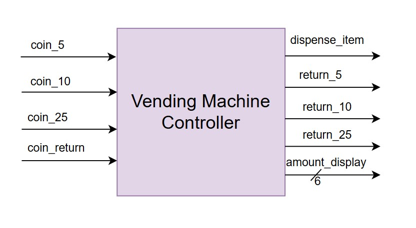
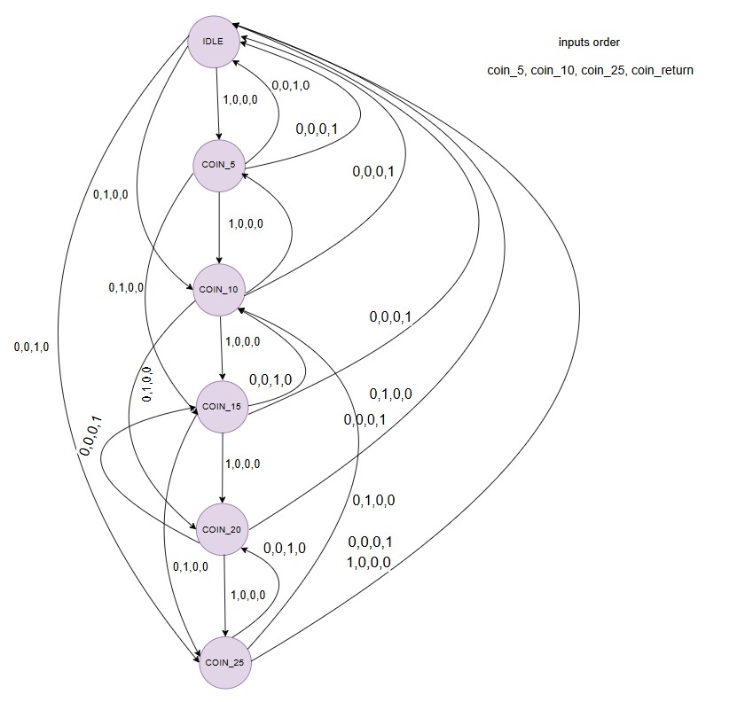
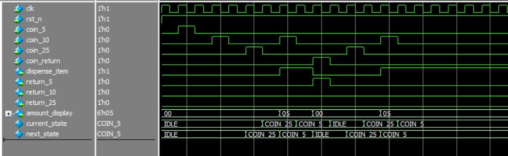
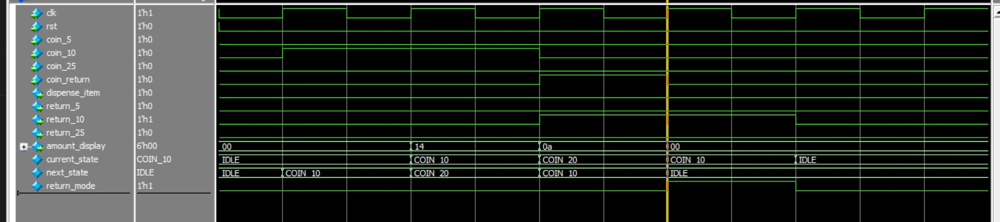

# 6.3 Lab 4B: Vending Machine Controller 
#### Specification 
● Accepts 5, 10, 25 cent coins 
● Dispenses 30-cent item 
● Provides correct change 
● Handles coin return request 
● LED display for current amount 
#### Design Methodology
1. List all possible states based on money inserted (0c, 5c, 10c, 15c, 20c, 25c ) 
2. Draw state transitions for each coin input 
3. Plan change-making logic (what coins to return?) 
4. Handle error conditions (coin jam, exact change only)

#### Overview
The **Vending Machine Controller**  FSM-based design , simulates a vending machine.  
It accepts coins, tracks the balance, and dispenses a product once the required amount is reached.  
If excess coins are inserted, it returns the change.

---

#### Block Diagram

 
 ---

### Vending Machine Table

---

### Vending Machine FSM

---

#### Interface (I/O)
| Signal        | Direction | Description                              |
|---------------|-----------|------------------------------------------|
| `clk`         | Input     | System clock                             |
| `reset`       | Input     | Active-high reset                        |
| `coin_in`     | Input     | Inserted coin            |
| `dispense`    | Output    | Signal to dispense product               |
| `change_out`  | Output    | Returned change amount                   |
| `balance`     | Output    | Current balance    |

---

#### Features
- Accepts multiple coin denominations (e.g., 5, 10, 25 units).
- Accumulates balance until product price is reached.
- Dispenses product automatically once enough balance is collected.
- Returns change when it's requested i-e change request.
 

---

#### Vending Machine FSM

This FSM represents a vending machine that accepts coins of 5, 10, and 25 cents, dispenses items, and can also return coins. The machine maintains states based on the total amount inserted.

#### States Description

- **IDLE**:  
  Initial state when no coin is inserted. Waiting for input.

- **COIN_5**:  
  Machine has received 5 cents. From here, it can go to 10c, 15c, or directly dispense with 25c input.  
  Coin return gives back 5c and then go to IDLE state.

- **COIN_10**:  
  Machine has received 10 cents. Can move to 15c, 20c, and dispense if 25c is inserted and then got to COIN_5 state.  
  Coin return gives back 10c or return request.

- **COIN_15**:  
  Machine has received 15 cents.It can take coins 5c,10c,  25c, and can  dispense item with 25c and will move to state COIN_10 if return request is high then will go to IDLE.  
  Coin return gives back 10c + 5c.

- **COIN_20**:  
  Machine has received 20 cents.  
  - If 10c is added : item gets dispensed.  
  - If 25c is added : item is dispensed with change i-e 5c,10c.  
  Coin return gives back 10c in 2 cycles.

- **COIN_25**:  
  Machine has received 25 cents. Directly dispenses item on next coin insertion if no return request then , it moves to dispense item-accumulated money state else  
  Coin return gives back the money and move to IDLE.

---

#### Example
- Insert `10c` + `25c` : Item dispensed and move state COIN_5.  

---

### Simulation

It can be see that when user demands return we move to idle state after returning,else we move to the coin states and whenever we've >=30 ,we always dispense item worth 30 and return change or move to some other state based on money left and user change in return demand.

### Special Case: 
#### If the user presses coin_return in COIN_20 state.
The FSM then moves to COIN_10 to return a 10-cent coin and return_mode is set . So,  
When in transits to COIN_10 with return_mode=1 in next cycle, the FSM directly transitions back to IDLE,this way return of 20 is handled.

---