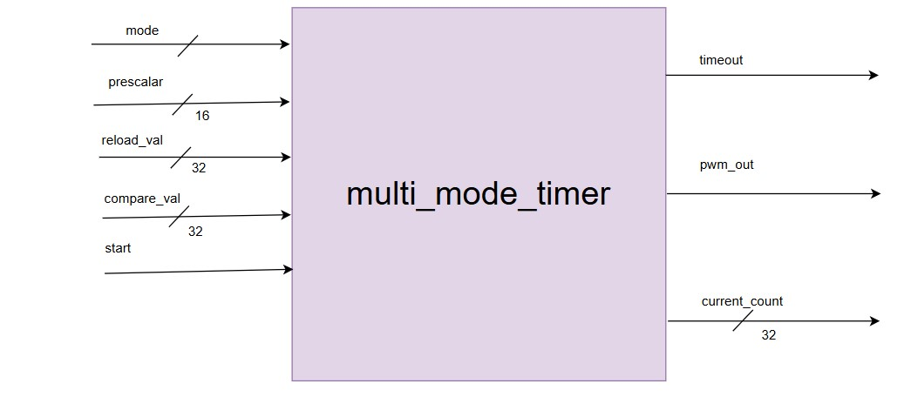
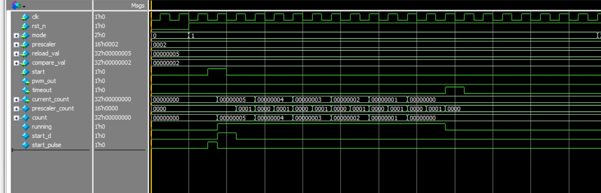
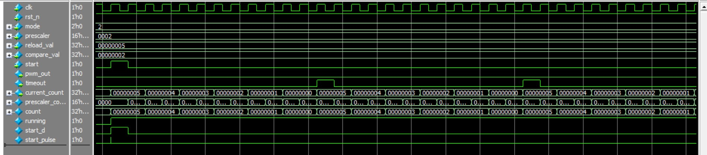
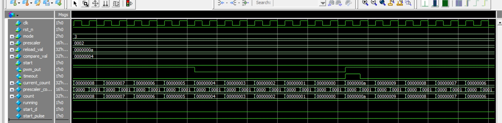

# 7.1 Lab 5A: Multi-Mode Timer 
#### Specification 
● 32-bit programmable timer with multiple modes: 
○ One-shot: Count down once and stop 
○ Periodic: Reload and restart automatically 
○ PWM: Generate PWM with programmable duty cycle 
● 1 MHz input clock, programmable prescaler 
● Interrupt generation capability 
#### Design Approach 
1. Design prescaler for clock division 
2. Plan mode control logic 
3. Design reload mechanism 
4. PWM duty cycle calculation 

#### Overview
This module implements a **32-bit programmable timer** with multiple modes:
- **One-shot mode (01):** Counts down once from the reload value to zero, then stops.
- **Periodic mode (10):** Automatically reloads the counter after reaching zero, creating a periodic timeout.
- **PWM mode (11):** Generates a Pulse Width Modulated (PWM) signal with programmable duty cycle using `reload_val` and `compare_val`.
- **Off mode (00):** Timer is disabled.

---

#### Block Diagram

---

#### Interface Ports

| Port Name      | Direction | Width   | Description |
|----------------|-----------|---------|-------------|
| `clk`          | Input     | 1       | System clock (1 MHz). |
| `rst_n`        | Input     | 1       | Active-low reset. |
| `mode`         | Input     | 2       | Timer mode selection:   `00=OFF`, `01=ONE_SHOT`, `10=PERIODIC`, `11=PWM`. |
| `prescaler`    | Input     | 16      | Clock divider value (timer ticks every `prescaler` cycles). |
| `reload_val`   | Input     | 32      | Initial counter value to load. |
| `compare_val`  | Input     | 32      | Duty cycle threshold for PWM mode. |
| `pwm_out`      | Output    | 1       | PWM waveform output. |
| `timeout`      | Output    | 1       | Timeout pulse (1-cycle pulse when counter reaches zero). |
| `current_count`| Output    | 32      | Current counter value. |

---

#### Approach

1. **Prescaler Design**  
   - A 16-bit prescaler divides the input clock.  
   - Timer counter decrements once every `prescaler` cycles.  

2. **Mode Control Logic**  
   - **OFF:** Timer disabled, no counting.  
   - **ONE_SHOT:** Counts down to zero once, then stops (`running=0`).  
   - **PERIODIC:** Reloads counter after reaching zero, continuous operation.  
   - **PWM:** Reloads counter at zero, and compares against `compare_val` to generate PWM duty cycle.  

3. **Reload Mechanism**  
   - On `start` pulse: counter loads `reload_val`.  
   - On timeout in periodic/PWM mode: counter reloads automatically.  

4. **PWM Duty Cycle Generation**  
   - `pwm_out = 1` when `count > compare_val`.  
   - Duty cycle = `(reload_val - compare_val) / reload_val`.  

5. **Timeout Handling**  
   - When counter reaches zero, `timeout` pulses high for one cycle.  
   - Useful for **interrupt requests** in a system.  

---

#### Operations
- On reset, timer clears everything.  
- On `start` pulse: counter loads `reload_val` and begins counting.  
- Prescaler ensures counting speed is configurable.  
- When counter reaches zero:
  - **One-shot:** Stops.  
  - **Periodic:** Reloads and continues.  
  - **PWM:** Reloads and generates waveform based on `compare_val`.  
- Timeout pulse signals events or triggers interrupts. 

---

#### Simulation

#### One Shot

#### Periodic Timer

#### Pwm

---
 