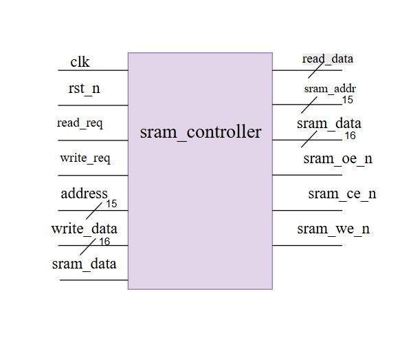
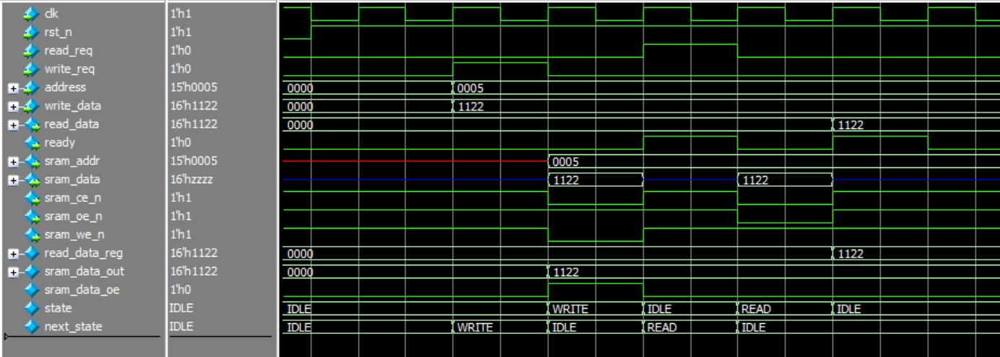

 
## 8. Lab 6: Memory Interfaces 
### 8.1 Lab 6A: Synchronous SRAM Controller 
### Specification 
● Interface to 32Kx16 synchronous SRAM 
● Single-cycle read/write operation 
● Address and data buses with proper timing 
● Chip enable and output enable control 

---

#### Overview

This module implements a **simple synchronous SRAM controller** using a finite state machine (FSM).  

#### SRAM Block Diagram

---

#### SRAM FSM

---
 

#### Features
- It handles both **read** and **write** requests.
- Handles **bidirectional data bus (`sram_data`)** .
- Generates `ready` signal once the transaction is complete i-e the write or read one.
 
---

#### Port Description

| Signal        | Direction | Width  | Description                              |
|---------------|-----------|--------|------------------------------------------|
| `clk`         | Input     | 1 bit  | System clock                             |
| `rst_n`       | Input     | 1 bit  | Active-low reset                         |
| `read_req`    | Input     | 1 bit  | Read request                             |
| `write_req`   | Input     | 1 bit  | Write request                            |
| `address`     | Input     | 15 bit | SRAM address                             |
| `write_data`  | Input     | 16 bit | Data to be written to SRAM               |
| `read_data`   | Output    | 16 bit | Data read from SRAM                      |
| `ready`       | Output    | 1 bit  | Signals completion of read/write         |
| `sram_addr`   | Output    | 15 bit | Address line to SRAM                     |
| `sram_data`   | Inout     | 16 bit | Bidirectional data bus                   |
| `sram_ce_n`   | Output    | 1 bit  | SRAM chip enable (active low)            |
| `sram_oe_n`   | Output    | 1 bit  | SRAM output enable (active low)          |
| `sram_we_n`   | Output    | 1 bit  | SRAM write enable (active low)           |

---

#### FSM States

#### 1. `IDLE`
- Default state after reset.
- `ready = 0`.
- Waits for either:
  - `write_req = 1` : move to **WRITE**
  - `read_req = 1` : move to **READ**

#### 2. `WRITE`
- Asserts:
  - `sram_ce_n = 0`
  - `sram_we_n = 0`
- Drives `write_data` on `sram_data`.
- After this,
  - Releases bus
  - `ready = 1`
- Next state : IDLE

#### 3. `READ`
- Captures valid data from `sram_data` into `read_data`.
- Deasserts `sram_oe_n` and `sram_ce_n`.
- `ready = 1`
- Next state : IDLE

---

#### Important Points
 `sram_data` is driven only during **write**; otherwise, it is high-impedance (`'z`).  
`read_data` is latched during the **READ** state.  
 The FSM  will returns to `IDLE` after every operation.  

**Internal Signal :** 
  sram_data_oe = 1 : controller is driving SRAM bus  i-e  write operation
  sram_data_oe = 0 : bus gets released by controller, SRAM will provide data read operation  i-e read operation

---

#### Simulation Waveform

---

 