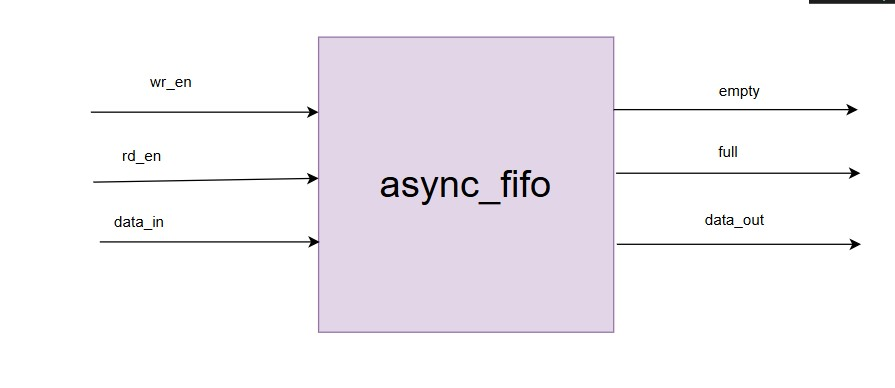
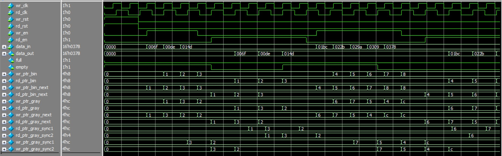

## 9.2 Asynchronous FIFO (Clock Domain Crossing) 
#### Specification 
● Handles different clock domains for read/write 
● Gray code pointers for safe domain crossing 
● Metastability protection 
● Proper flag synchronization 
#### Critical Design Points 
1. Gray code pointer generation and comparison 
2. Multi-flop synchronizers for domain crossing 
3. Flag generation timing to avoid false flags 
4. Reset handling across clock domains 

#### Asynchronous FIFO

This module implements an **asynchronous FIFO** with independent write (`wr_clk`) and read (`rd_clk`) clock domains.  
It uses **Gray code pointers** with synchronizers to safely transfer read/write pointers across clock domains.  
The FIFO supports configurable **data width and depth**, with proper `full` and `empty` flag generation.  
 
---
#### Block Diagram


---

#### Logic  

1. **Binary and Gray Pointers**
   - Write and read pointers are maintained in **binary** (`wr_ptr_bin`, `rd_ptr_bin`).  
   - For synchronization across clock domains, they are also stored in **Gray code** (`wr_ptr_gray`, `rd_ptr_gray`).  
   - Conversion:  
     ```
     gray = (bin >> 1) ^ bin
     ```
   
2. **Write Domain (wr_clk)**
   - On each rising edge of `wr_clk`:  
     - If `wr_en` and FIFO is not full, `data_in` is stored at the `wr_ptr_bin` location in memory.  
     - Pointer updates: `wr_ptr_bin → wr_ptr_bin_next` and `wr_ptr_gray → wr_ptr_gray_next`.  

3. **Read Domain (rd_clk)**
   - On each rising edge of `rd_clk`:  
     - If `rd_en` and FIFO is not empty, `data_out` gets the word from memory at `rd_ptr_bin`.  
     - Pointer updates: `rd_ptr_bin` to `rd_ptr_bin_next` and `rd_ptr_gray` to `rd_ptr_gray_next`.  

4. **Pointer Synchronization**
   - Since write logic needs **read pointer info** and read logic needs **write pointer info**, Gray-coded pointers are passed between domains.  
   - A **two-stage synchronizer** is used in both directions (`rd_ptr_gray_sync1/2`, `wr_ptr_gray_sync1/2`).  

5. **Empty / Full Detection**
   - **Empty**: when `rd_ptr_gray == wr_ptr_gray_sync2`.  
     then,both pointers are the same (no data to read).  
   - **Full**: when the **next write pointer** equals the **synchronized read pointer** with MSB inverted.  
    this condition is ensuring the FIFO is full.

---

#### Example Run
- **Write side** (`wr_clk` domain):  
  - `wr_en=1` with data `0xA5`. Data stored in memory at location `wr_ptr_bin`.  
  - Pointer increments and `wr_ptr_gray` updates.  

- **Read side** (`rd_clk` domain):  
  - When `rd_en=1` and FIFO not empty, data comes out in the order written: `0xA5`.  
  - `rd_ptr_bin` and `rd_ptr_gray` update accordingly.  

---
#### Sources Used
read some articles on async_fifo to understand how it really works accross different clock domains and searched about its full and empty conditions.

---

#### Simulation
