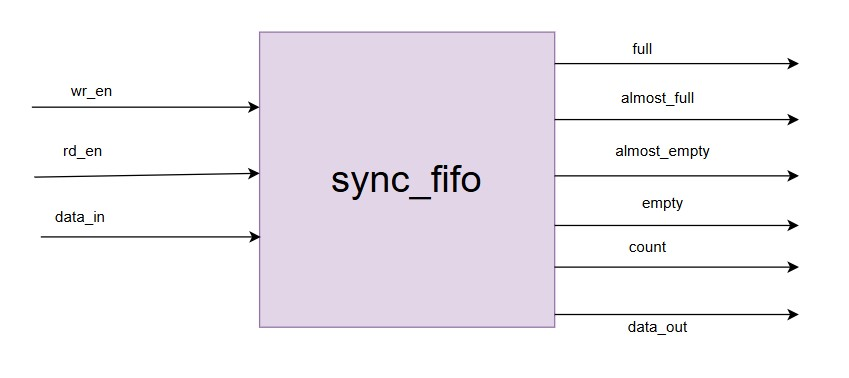
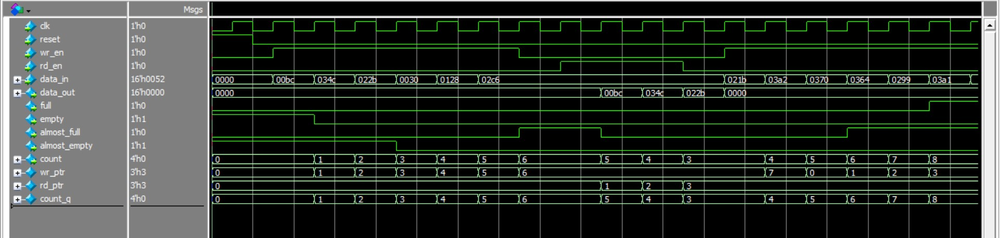

# 9.1 Synchronous FIFO 
#### Specification 
● Parameterizable width and depth 
● Full/empty flag generation 
● Almost-full/almost-empty thresholds 
● Efficient FPGA block RAM utilization 
 
#### Overview
This module implements a **synchronous FIFO** with a single clock domain (`clk`).  
It has configurable **data width and depth**, along with `full`, `empty`, `almost_full`, and `almost_empty` flags.  
A **counter (`count`)** tracks the number of stored entries, enabling precise flow control.  
Circular buffer logic (`wr_ptr`, `rd_ptr`) manages writes and reads, ensuring reliable FIFO operation.  

---

#### Block Diagram

---
#### Logic

1. **Write Logic**  
   - On each `clk`, if `wr_en=1` and FIFO is not `full`, input data is written into memory at `wr_ptr`.  
   - `wr_ptr` increments and wraps around using modulo (`FIFO_DEPTH`).  

2. **Read Logic**  
   - On each `clk`, if `rd_en=1` and FIFO is not `empty`, data at `rd_ptr` is driven on `data_out`.  
   - `rd_ptr` increments and wraps around like `wr_ptr`.  
   - If no read occurs, `data_out` is cleared to zero.  

3. **Count Logic**  
   - `count_q` keeps track of how many entries are in FIFO.  
   - Increments on write (without read).  
   - Decrements on read (without write).  
   - Stays the same if both write and read occur simultaneously.  

4. **Flag Logic**  
   - `full` : when `count_q == FIFO_DEPTH`.  
   - `empty` : when `count_q == 0`.  
   - `almost_full` : when entries ≥ threshold.  
   - `almost_empty` : when entries ≤ threshold.  

---

#### Simulation

---