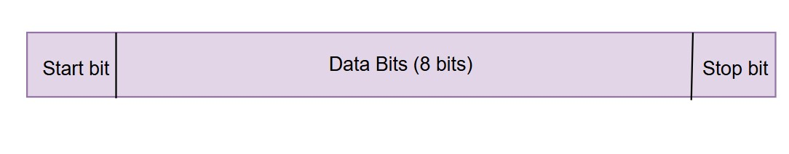
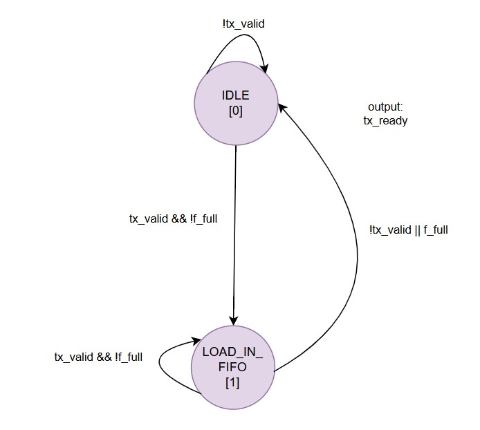
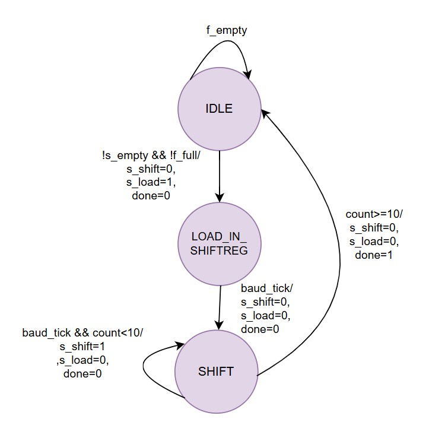
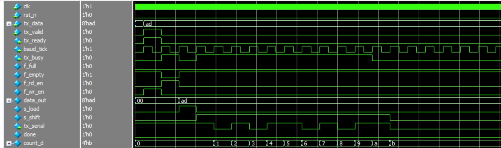
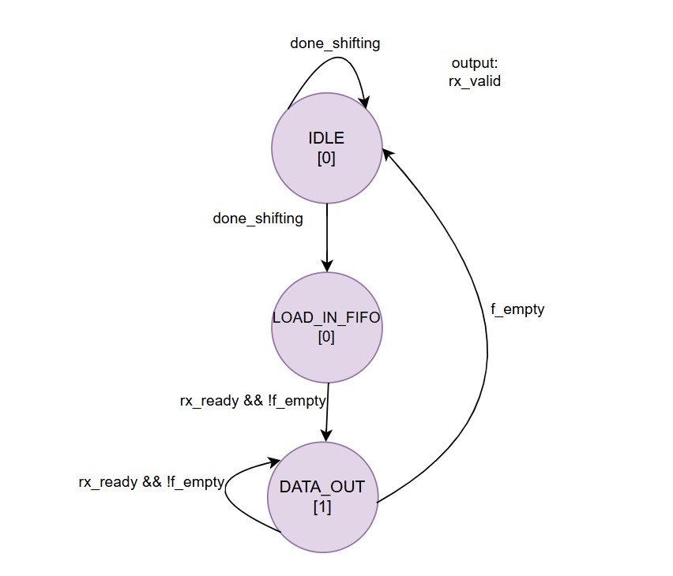
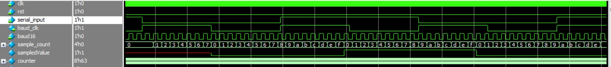
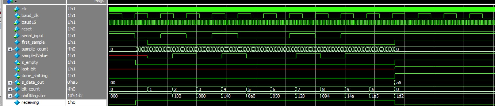

## 10. Lab 8: UART Controller 
### 10.1 UART Transmitter 
### Specification 
● Configurable baud rate (9600, 19200, 38400, 115200) 
● 8-bit data, 1 start bit, 1 stop bit, optional parity 
● Transmit FIFO with configurable depth 
● Status flags: busy, FIFO full/empty 
### Design Steps 
1. Calculate baud rate generation - create timing diagram 
2. Draw UART frame format 
3. Design transmit state machine 
4. Integrate with FIFO 
### Baud Rate Generator Calculation

The **baud rate generator** produces a timing pulse (`baud_tick`) so that the UART can transmit and receive bits at the correct rate.

### Formula

To generate the baud rate clock from the system clock:

\[
N = \frac{f_{clk}}{2*f_{baud}}
\]

Where:  
- \( f_{clk} \) = System clock frequency (Hz)  
- \( f_{baud} \) = Desired baud rate (bits per second)  
- \( N \) = Divider value (number of system clock cycles per baud tick)

---
### Uart Frame Format

---
### Transmitter FSM's
#### Transmitter Fifo Fsm

#### Transmitter ShiftRegister Fifo Fsm

### UART Transmitter Module

This module implements a **UART transmitter** with a FIFO buffer and shift register, supporting configurable baud rate and system clock.

#### Features
- FIFO buffer with configurable depth.
- Shift register transmits **start bit, 8 data bits, and stop bit** serially.
- Baud rate generator produces `baud_tick` to control timing of transmission.
- Signals for flow control: `tx_ready`, `tx_busy`, `tx_valid`.

#### Inputs
- `clk` : System clock  
- `rst_n` : Active-low reset  
- `tx_data` : 8-bit data byte to transmit  
- `tx_valid` : Pulse to write data into FIFO  

#### Outputs
- `tx_ready` : High when FIFO can accept more data  
- `tx_serial` : Serial output line for UART transmission  
- `baud_tick` : Tick signal from baud rate generator  
- `tx_busy` : High when transmitter is busy sending data  

#### Internal Blocks
1. **Baud Rate Generator** (`baud`)  
   - Generates `baud_tick` for timing shift register and FIFO operations.
2. **FIFO**  
   - Stores bytes to be transmitted.
   - Signals: `f_full`, `f_empty`.
3. **FIFO Controller** (`fifo_controller`)  
   - Controls FIFO read/write based on `tx_valid` and `tx_ready`.
4. **Shift Register** (`shiftRegister`)  
   - Serializes 8-bit data with start and stop bits.
   - Controlled by signals `s_load` and `s_shift`.
5. **Shift Register Controller** (`shiftreg_controller`)  
   - Generates shift/load signals and indicates when transmission is done.
6. **Busy Logic**  
   - `tx_busy` is high when FIFO has data or shift register is not empty.

#### Timing Notes
- Each byte is transmitted **one start bit + 8 data bits + stop bit**.
- Transmission occurs on **baud_tick edges**.
- FIFO ensures smooth transmission without data loss.

#### Transmitter Simulation

---

### Receiver FSM

### UART Receiver Module

This module implements a **UART receiver** with a FIFO buffer and oversampled shift register, supporting configurable baud rate and system clock.

#### Features
- **Oversampling**: Uses a 16× baud clock (`baud16_clk`) for  sampling.
- **FIFO buffer**: Stores received bytes to prevent data loss.
- **Framing error detection**: Checks stop bit validity.

#### Inputs
- `clk` : System clock  
- `rst` : Active-high reset  
- `rx_serial` : Incoming UART serial line  
- `rx_ready` : Processor request to read a received byte  

#### Outputs
- `rx_data` : 8-bit received data  
- `rx_valid` : High when a byte is available in FIFO  
- `frame_error` : High if stop bit is invalid  
- `baud_clk` : Continuous baud clock  

#### Internal Blocks
1. **Baud Generators**
   - `baud16`: Generates 16× oversampling clock (`baud16_clk`) for precise mid-bit sampling.
   - `baud`: Generates standard baud clock (`baud_clk`) for FIFO and controller timing.
2. **Shift Register**
   - Samples serial input at mid-bit intervals.
   - Outputs 8-bit data after receiving a full byte.
3. **Controller**
   - Manages FIFO read/write and signals `rx_valid`.
   - Ensures proper flow of data to the processor.
4. **FIFO**
   - Stores received bytes along with framing error bit.
   - `f_wr_en` controlled by `done_shifting` and `f_full`.
   - `f_rd_en` controlled by processor read (`rx_ready`) and `rx_valid`.

#### Timing Notes
- Each byte: **1 start bit + 8 data bits + 1 stop bit**.
- FIFO ensures smooth reception even if processor reads are delayed.
- `rx_valid` indicates when data is ready to be read.
- Framing error is captured in `frame_error` for invalid stop bits.

#### Sampling Method
- The incoming line is oversampled at **16× the baud rate**.
- **Start bit detection**: reception begins when `serial_input` goes low.
- **First sample**: taken at the middle of the start bit (after 7 ticks of `baud16`).
- **Data bits**: each subsequent bit is sampled every 16 ticks of `baud16` (mid-bit sampling).
- **Stop bit**: checked after the last data bit to validate frame completion.

#### Features
- Detects **start bit**, shifts 8 data bits, and validates **stop bit**.
- Stores received frame in a **10-bit shift register** (start + 8 data + stop).
- Provides the final byte on `s_data_out`.

#### Outputs
- `done_shifting`: High when a full byte is received.
- `s_empty`: High when idle, Low during reception.
- `last_bit`: Captures the stop bit after reception.

#### Timing
- **1 baud_clk cycle** = 16 cycles of `baud16`.
- Sampling occurs at the **middle of each bit period** for noise tolerance.

#### Controller (FIFO Interface)

This module controls the flow of data between the **UART Shift Register** and the **FIFO buffer**.  
 

#### FSM States
1. **IDLE**  
   - Waits for `done_shifting` (indicates a byte has been received).  
   - If FIFO is not full, transitions to `LOAD_IN_FIFO`.

2. **LOAD_IN_FIFO**  
   - One-cycle state to write received data into FIFO.  
   - Moves to `DATA_OUT`.

3. **DATA_OUT**  
   - As long as FIFO is not empty, data is considered **valid** (`rx_valid = 1`).  
   - If FIFO becomes empty, transition back to `IDLE`.

#### Inputs
- `clk` : System clock  
- `rst` : Active-high reset  
- `rx_ready` : Processor request to read data  
- `f_empty` : FIFO empty status  
- `f_full` : FIFO full status  
- `done_shifting` : Indicates UART shift register has received a full byte  

#### Outputs
- `rx_valid` : High when FIFO has valid data to output  

#### Features
- Prevents overflow by checking `f_full` before writing.  
- Ensures continuous data output while FIFO has valid bytes.  
- Synchronizes UART receiver with FIFO for reliable data transfer.  

#### Receiver Top Module

#### Receiver Sampling Data 

#### Receiver Shifting Data 
