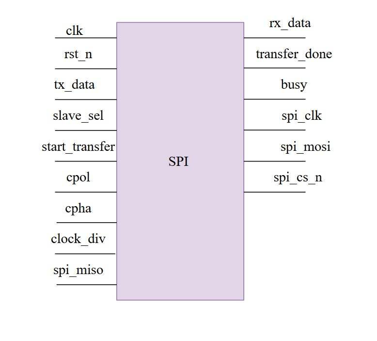
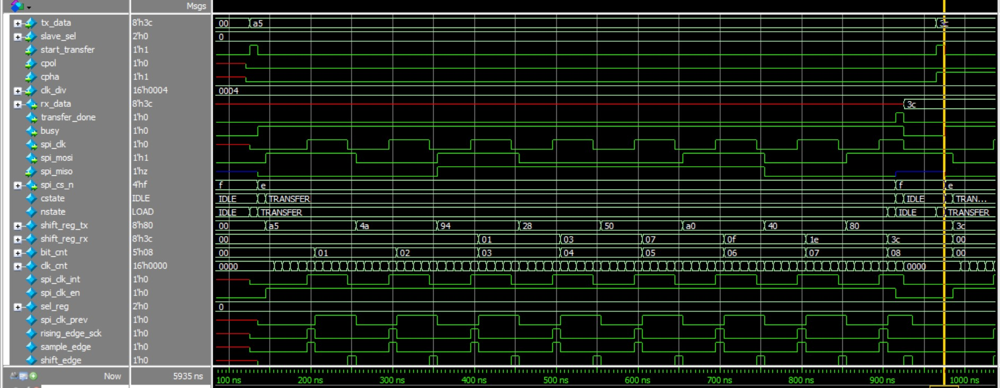
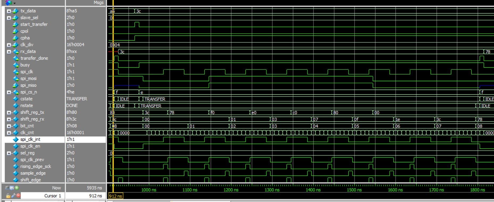
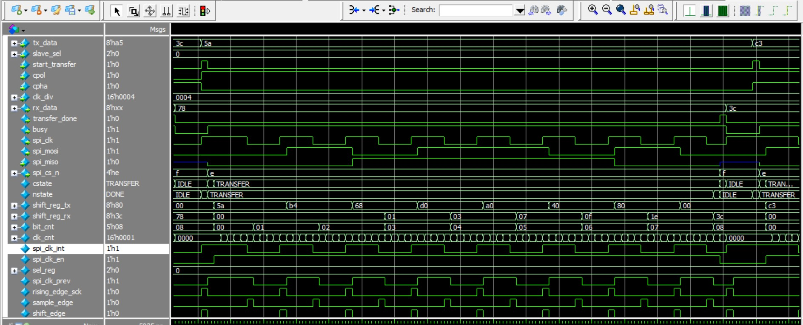
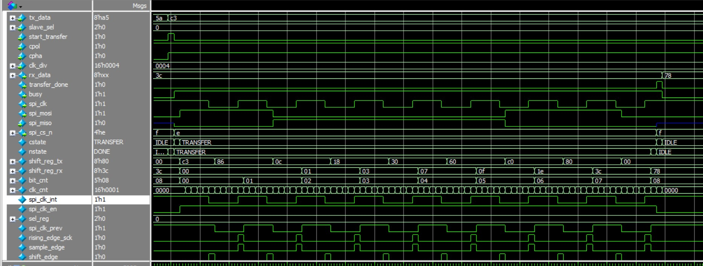

# Lab 7: Serial Peripheral Interface (SPI)

## 7.1 Lab 7A: SPI Master Controller  

---

## Specification
- Supports up to `NUM_SLAVES` devices (parameterizable).  
- Configurable data width (`DATA_WIDTH`).  
- Configurable clock polarity (`CPOL`) and clock phase (`CPHA`).  
- Programmable clock divider for SPI SCLK generation.  
- Full-duplex operation (MOSI + MISO).  
- Slave select (`CS_n`) control.  
- Transfer done and busy indication.  

---

## Overview
This module implements a **parameterized SPI Master controller** that can communicate with multiple slaves.  
It uses a **finite state machine (FSM)** to handle data transfer operations (load, transfer, and done).  

---

## Block Diagram

---

## FSM

---

#### Features
- Supports **multiple slave devices** (`NUM_SLAVES`).  
- **Programmable clock divider** (`clk_div`) for SCLK frequency.  
- Configurable **SPI modes (0, 1, 2, 3)** using `CPOL` and `CPHA`.  
- Full-duplex transfer using **shift registers**.  
- **Transfer done** signal at the end of data transmission.  
- Keeps track of slave select (`spi_cs_n`).  

---

#### Port Description

| Signal           | Direction | Width                  | Description                                                                 |
|------------------|-----------|------------------------|-----------------------------------------------------------------------------|
| `clk`            | Input     | 1 bit                  | System clock                                                                |
| `rst_n`          | Input     | 1 bit                  | Active-low reset                                                            |
| `tx_data`        | Input     | DATA_WIDTH             | Data to be transmitted (MOSI)                                               |
| `slave_sel`      | Input     | log2(NUM_SLAVES)       | Slave select index                                                          |
| `start_transfer` | Input     | 1 bit                  | Start SPI transfer                                                          |
| `cpol`           | Input     | 1 bit                  | Clock polarity (idle = high/low)                                            |
| `cpha`           | Input     | 1 bit                  | Clock phase (data sample edge selection)                                    |
| `clk_div`        | Input     | 16 bit                 | Clock divider for SCLK generation                                           |
| `rx_data`        | Output    | DATA_WIDTH             | Received data (MISO)                                                        |
| `transfer_done`  | Output    | 1 bit                  | Signals completion of SPI transfer                                          |
| `busy`           | Output    | 1 bit                  | High during transfer                                                        |
| `spi_clk`        | Output    | 1 bit                  | SPI clock output                                                            |
| `spi_mosi`       | Output    | 1 bit                  | SPI master-out-slave-in                                                     |
| `spi_miso`       | Input     | 1 bit                  | SPI master-in-slave-out                                                     |
| `spi_cs_n`       | Output    | NUM_SLAVES             | Active-low chip select for slaves                                           |

---

#### FSM States

#### 1. `IDLE`
- Default after reset.  
- Waits for `start_transfer = 1`.  
- Captures selected slave (`slave_sel`).  

#### 2. `LOAD`
- Loads `tx_data` into transmit shift register.  
- Clears receive shift register.  
- Resets bit counter.  

#### 3. `TRANSFER`
- Generates **SCLK** using clock divider.  
- Depending on **CPHA**:  
  - Data shifted out (`MOSI`) on one clock edge.  
  - Data sampled in (`MISO`) on the opposite edge.  
- Bit counter increments per data bit.  

#### 4. `DONE`
- Transfer complete.  
- `rx_data` updated with received data.  
- `transfer_done = 1`.  
- Returns to `IDLE`.  

---

### SPI Modes (CPOL, CPHA)

| Mode | CPOL | CPHA | Description                                                                 |
|------|------|------|-----------------------------------------------------------------------------|
| 0    | 0    | 0    | Clock idle low, data captured on rising edge, shifted on falling edge        |
| 1    | 0    | 1    | Clock idle low, data captured on falling edge, shifted on rising edge        |
| 2    | 1    | 0    | Clock idle high, data captured on falling edge, shifted on rising edge       |
| 3    | 1    | 1    | Clock idle high, data captured on rising edge, shifted on falling edge       |

---

 
- Only the selected slave (`spi_cs_n[slave_sel] = 0`) is active.  
- `busy = 1` during `TRANSFER`.  
- Clock is gated (disabled) in `IDLE` and `DONE` states.  
- Full duplex:  
  - `MOSI` sends out data while  
  - `MISO` receives data simultaneously.  

---

### Simulation Waveform
**SPI 00 Mode:**

**SPI 01 Mode:**

**SPI 10 Mode:**

**SPI  11 Mode:**

---
