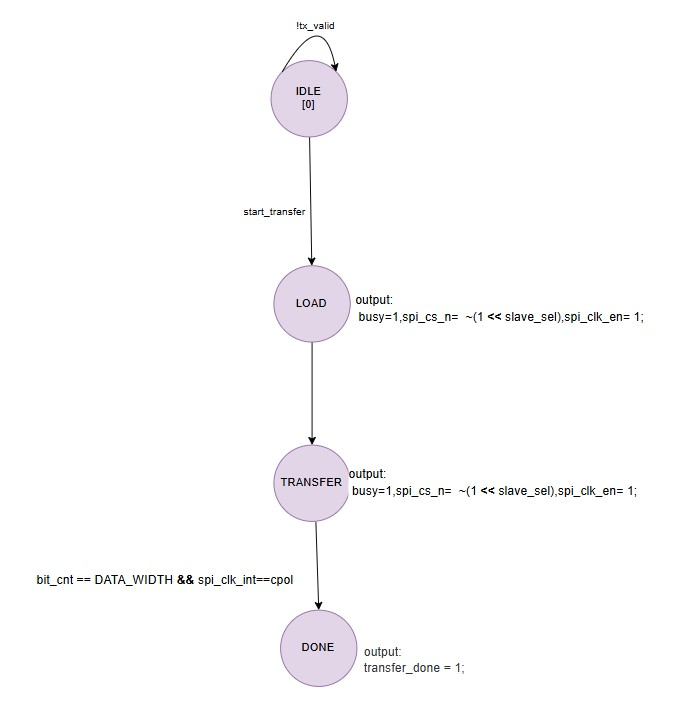

### 11.1 SPI Master Controller 
### Specification 
● Configurable clock polarity and phase (CPOL/CPHA) 
● Variable clock frequency 
● Automatic slave select control 
● Bidirectional data transfer 
### Design Methodology 
1. Understand SPI timing for all CPOL/CPHA combinations 
2. Draw timing diagrams for each mode 
3. Design shift register for data transfer 
4. Plan slave select timing

### SPI FSM

 
This module implements a simple FSM-based controller for synchronous SRAM.  
It supports **read and write requests** with handshake signaling using a `ready` flag.  
The controller manages **chip enable, output enable, and write enable** signals for SRAM access.  
A bidirectional data bus (`sram_data`) is used to write data to or read data from the SRAM device.

#### Sources Used
to understand its working and to get how it's code would be , I used:
AI
Youtube

#### Simulation
