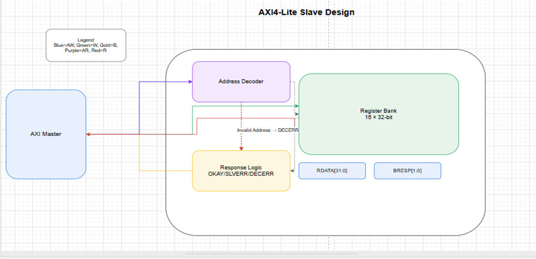
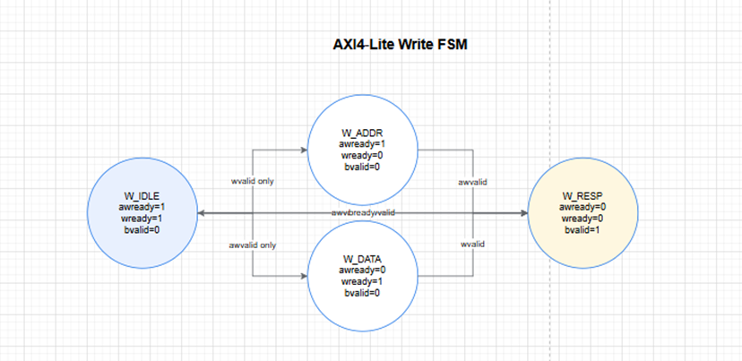

# AXI4-Lite Protocol and Slave Design

## Introduction
The AXI4-Lite protocol is a simplified subset of the Advanced eXtensible Interface (AXI4) standard defined by ARM.  
It supports only single 32-bit read and write transactions, making it suitable for low-complexity register interfaces.  
Compared to full AXI4, AXI4-Lite removes burst support and simplifies buffering, while maintaining compatibility with AXI masters.  

---

## Key Characteristics
- 32-bit address bus and 32-bit data bus  
- No burst transfers   
- Five independent channels:  
  - Write Address (AW)  
  - Write Data (W)  
  - Write Response (B)  
  - Read Address (AR)  
  - Read Data (R)  
- VALID/READY handshake on all channels  
  - Transfer occurs when VALID=1 and READY=1 in the same cycle  
- Simple error reporting using BRESP (for writes) and RRESP (for reads)  

---

## Slave Interface

### Inputs
- ACLK: Global system clock  
- ARESETn: Active-low reset  
- AWADDR [31:0]: Write address  
- AWVALID: Write address valid  
- WDATA [31:0]: Write data  
- WSTRB [3:0]: Write strobes (byte enables)  
- WVALID: Write data valid  
- BREADY: Write response ready  
- ARADDR [31:0]: Read address  
- ARVALID: Read address valid  
- RREADY: Read data ready  

### Outputs
- AWREADY: Slave ready for write address  
- WREADY: Slave ready for write data  
- BRESP [1:0]: Write response (OKAY or SLVERR)  
- BVALID: Write response valid  
- ARREADY: Slave ready for read address  
- RDATA [31:0]: Read data  
- RRESP [1:0]: Read response (OKAY or SLVERR)  
- RVALID: Read data valid  
---

---

---

## Write Operation
1. Master asserts AWVALID with target address.  
2. Slave responds with AWREADY when it can accept the address.  
3. Master asserts WVALID with write data (WDATA).  
4. Slave asserts WREADY when it can accept the data.  
5. Once both address and data are accepted, the slave updates its register bank.  
6. Slave asserts BVALID with BRESP (00 = OKAY, 10 = SLVERR).  
7. Master asserts BREADY to acknowledge, completing the transaction.  

---

## Read Operation
1. Master asserts ARVALID with read address (ARADDR).  
2. Slave asserts ARREADY when it accepts the address.  
3. Slave decodes address:  
   - If valid → fetches data from register bank  
   - If invalid → prepares error response  
4. Slave asserts RVALID with data (RDATA) and response (RRESP).  
5. Master asserts RREADY to accept the data.  
6. Transaction completes, slave deasserts RVALID.  
   

---

## Table

| Channel | Signals         | Purpose                  |
|---------|-----------------|--------------------------|
| Write Address | AWADDR, AWVALID, AWREADY | Provides target address for write |
| Write Data    | WDATA, WSTRB, WVALID, WREADY | Transfers write data and byte enables |
| Write Response| BRESP, BVALID, BREADY | Acknowledges completion of write |
| Read Address  | ARADDR, ARVALID, ARREADY | Provides target address for read |
| Read Data     | RDATA, RRESP, RVALID, RREADY | Transfers read data and response |

---

## AI Usage
- Used AI to reformat the original notes into Markdown.  
- Used AI to understand how to handle cases where W, AW, or both arrive at same time.  
- Used AI to clarify the correct logic for managing valid(read/write) signals in both write and read transactions.  
- Used AI to resolve syntax errors during implementation.  

