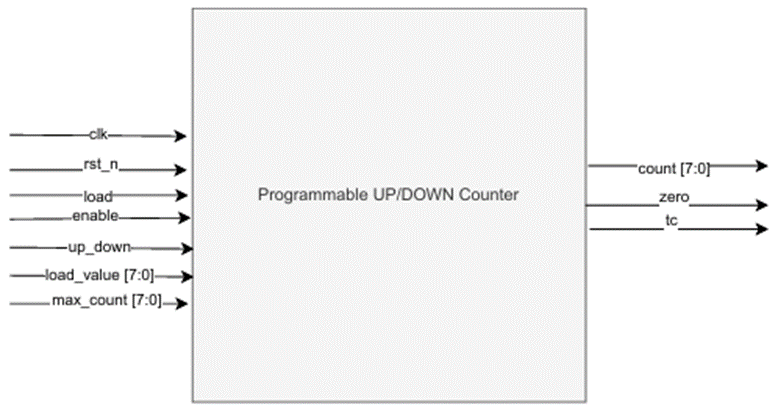
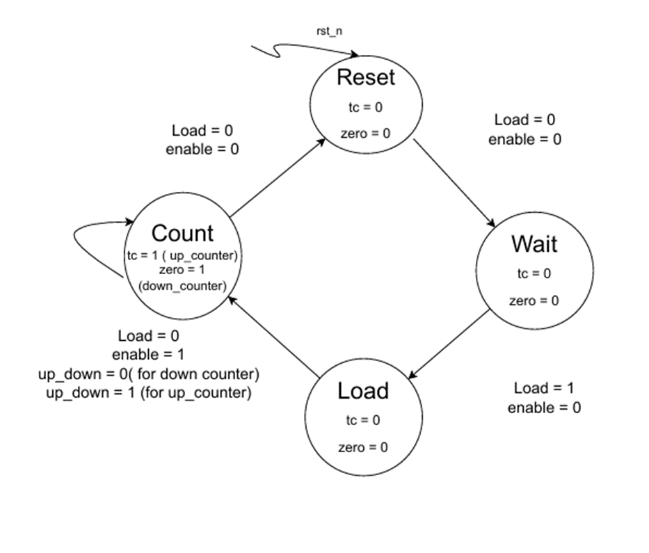

# Lab 3A: Programmable Counter

## Introduction
An 8-bit programmable counter is the one that can count up or down based on control signals.  
The design supports loading an initial value, setting a maximum value for up-counting, and provides status flags when the counter reaches zero or the terminal count.  

---

## Purpose
The programmable counter is a fundamental sequential circuit that can be used in digital systems such as timers, event counters, and control units.  
It demonstrates:  
- Loadable initial value  
- Selectable counting direction (up or down)  
- Terminal count detection  
- Zero detection  

---

---

## Interface Signals

### Inputs
- clk (logic): System clock. Counter updates on rising edge.  
- rst_n (logic): Active-low asynchronous reset → resets counter to 0.  
- load (logic): Loads load_value into the counter when high.  
- enable (logic): Enables counting when high.  
- up_down (logic): Counting direction.  
  - 1 → Up counter (counts from load_value to max_count).  
  - 0 → Down counter (counts from load_value to 0).  
- load_value (8-bit logic): Starting value to load.  
- max_count (8-bit logic): Maximum count value for up mode.  

### Outputs
- count (8-bit logic): Current counter value.  
- tc (logic): Terminal count flag, set when count = max_count in up mode.  
- zero (logic): Zero flag, set when count = 0 in down mode.  

---

## Finite State Machine (FSM)

### States
1. Reset: Initializes counter to 0.  
2. Wait (Idle): Counter is idle until load or enable is asserted.  
3. Load: Loads load_value into counter.  
4. Count: Counter increments (up mode) or decrements (down mode).  
  

## State Transition Table

| Current State | Input Condition                  | Next State | Outputs              |
|---------------|----------------------------------|------------|----------------------|
| Reset         | rst_n=0                          | Reset      | tc=0, zero=0         |
| Wait          | enable=0, load=0                 | Wait       | tc=0, zero=0         |
| Wait          | load=1, enable=0                 | Load       | tc=0, zero=0         |
| Load          | load=0, enable=1                 | Count      | tc=0, zero=0         |
| Count         | load=0, enable=1                 | Count      | tc=1 (if up, max)   zero=1 (if down, 0) |
| Count         | load=0, enable=0                 | Wait       | tc=0, zero=0         |

---

## Examples

### Example 1: Up Counter
- load=1, load_value=5, up_down=1  
- Counter starts at 5 → counts up until max_count=10  
- tc=1 when count=10  

---

### Example 2: Down Counter
- load=1, load_value=8, up_down=0  
- Counter starts at 8 → counts down until 0  
- zero=1 when count=0  

---

## AI Usage
- Used AI for formatting of  README file  

---

