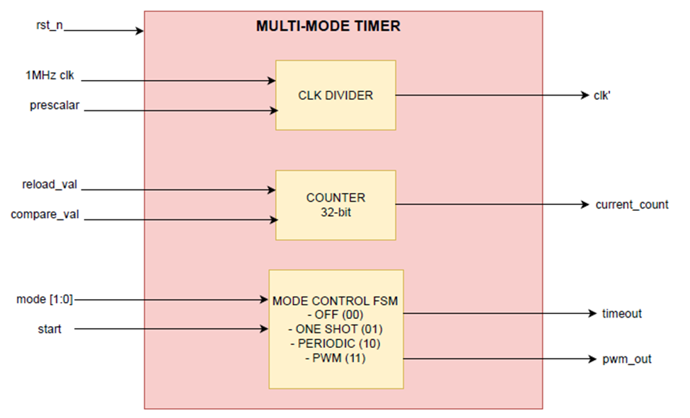

# Lab 5A: Multi-Mode Timer

## Introduction
The multi-mode timer is a configurable hardware timer that can operate in different modes depending on the system requirements.  
It supports four modes:
- 00 → Off: Timer disabled.  
- 01 → One-shot: Counts down once from reload_val to 0, asserts timeout, then stops.  
- 10 → Periodic: Counts down repeatedly from reload_val to 0, asserts timeout each cycle, then reloads.  
- 11 → PWM: Generates a Pulse Width Modulated signal based on reload_val (period) and compare_val (duty cycle).  

---

## Inputs
- clk: System clock.  
- rst_n: Active-low reset. Clears counter and outputs.  
- mode (2 bits): Selects operating mode (00=Off, 01=One-shot, 10=Periodic, 11=PWM).  
- prescaler (16 bits): Divides system clock for slower counting.  
- reload_val (32 bits): Value loaded into counter on start or reload.  
- compare_val (32 bits): Used in PWM mode to set duty cycle.  
- start: Rising edge initializes counter with reload_val.  

## Outputs
- timeout: Goes high when counter reaches 0 (stays high in one-shot, pulses in periodic/PWM).  
- pwm_out: PWM waveform output in mode 11.  
- current_count (32 bits): Current value of down-counter.  

---

---

## How It Works by Mode

### Mode 00: Off
- Counter holds at 0.  
- timeout = 0, pwm_out = 0.  

---

### Mode 01: One-shot
- On start, counter loads reload_val.  
- Decrements until it reaches 0.  
- At 0: timeout = 1 (stays high).  
- pwm_out = 0.  
- Timer stops automatically.  

**Example:** reload_val = 5 → current_count: 5,4,3,2,1,0 → timeout=1 at zero.  

---

### Mode 10: Periodic
- On start, counter loads reload_val.  
- Decrements each prescaler tick.  
- At 0: timeout = 1 for one cycle, counter reloads automatically.  
- pwm_out = 0.  
- Repeats continuously.  

**Example:** reload_val = 3 → current_count: 3,2,1,0 → reload → 3... → timeout pulses at each zero.  

---

### Mode 11: PWM
- On start, counter loads reload_val.  
- Decrements until 0, then reloads with reload_val.  
- timeout = 1 each time counter rolls over.  
- pwm_out = 1 if current_count >= compare_val, else 0.  
- Generates PWM waveform with:  
  - Period = reload_val  
  - Duty cycle = compare_val / reload_val  

**Example:** reload_val=100, compare_val=25 → pwm_out high for 75 cycles, low for 25 cycles → 25% duty cycle.  

---

## Mode Change Behavior
- If mode changes while running:  
  - Counter reloads with reload_val.  
  - timeout and pwm_out reset.  
  - Ensures clean restart in the new mode.  

---

## AI Usage
- Used AI to fix the issue of the counter reloading repeatedly.  
- Used AI to convert Word-based file to a README.  

