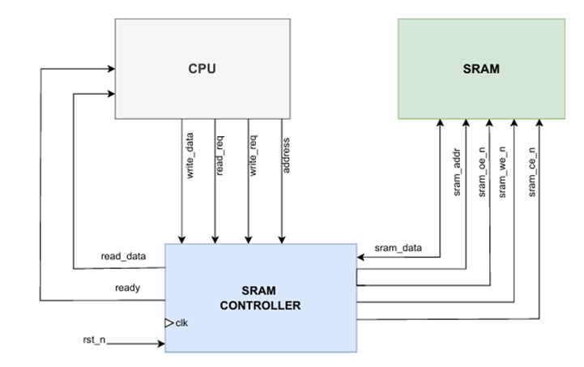

# Lab: Synchronous SRAM Controller

## Introduction
Static Random Access Memory (SRAM) is a fast but volatile memory technology. Unlike DRAM, it does not require refresh cycles and retains data as long as power is applied.  
This lab focuses on a 32K × 16 synchronous SRAM, which provides a 15-bit address bus  and transfers data through a 16-bit bidirectional bus.

Since raw SRAM devices expose low-level signals (chip enable, output enable, write enable), a dedicated controller is required. The controller sequences operations correctly and manages bus direction to avoid contention. It provides a simple, high-level request/ready interface for system logic.

---

## Inputs
- clk: System clock.  
- rst_n: Active-low reset, clears controller state.  
- read_req: One-cycle pulse to request a read when ready=1.  
- write_req: One-cycle pulse to request a write when ready=1.  
- address [14:0]: 15-bit word address for read/write.  
- write_data [15:0]: Data word to be written into SRAM.  

## Outputs
- read_data [15:0]: Captured data word returned from SRAM during a read.  
- ready: High when controller is idle and able to accept a new request.  
---

---

## SRAM Device Signals (driven by controller)
- sram_addr [14:0]: Address lines to the SRAM.  
- sram_ce_n: Active-low chip enable.  
- sram_oe_n: Active-low output enable (asserted for reads).  
- sram_we_n: Active-low write enable (asserted for writes).  
- sram_data [15:0]: Bidirectional data bus.  
  - Driven by controller during writes.  
  - Driven by SRAM during reads.  
  - Left high-impedance (Z) between operations.  

---

## Write Operation
1. User asserts write_req=1 for one cycle while ready=1.  
2. Controller latches address and write_data.  
3. On next cycle:  
   - sram_ce_n=0 (chip enabled)  
   - sram_we_n=0 (write enabled)  
   - sram_oe_n=1 (disabled to prevent SRAM driving)  
   - Controller drives sram_data with latched write_data  
4. On following clock edge:  
   - Controller releases data bus (Z)  
   - Write enable is deasserted  
   - ready returns high  

---

## Read Operation
1. User asserts read_req=1 for one cycle while ready=1.  
2. Controller latches address.  
3. On next cycle:  
   - sram_ce_n=0 (chip enabled)  
   - sram_oe_n=0 (output enabled)  
   - sram_we_n=1 (disabled)  
   - Controller tri-states its data drivers  
   - SRAM drives sram_data with addressed word  
4. Controller captures this data into read_data  
5. Output drivers disabled, ready reasserted  

---

## Data Bus Direction
- During write: Controller drives sram_data  
- During read: SRAM drives sram_data  
- Between transactions: Neither side drives, bus in high-impedance (Z)  

This ensures there is no bus contention (two drivers active at once).

---

## Quick Reference Table

| Operation | Controller Drives | SRAM Drives | Control Signals         |
|-----------|------------------|-------------|-------------------------|
| Write     | Address + Data   | —           | CE=0, WE=0, OE=1        |
| Read      | Address          | Data        | CE=0, WE=1, OE=0        |
| Idle      | —                | —           | CE=1 (disabled)         |

---

## AI Usage
- Used AI to format the Word-style documentation into a structured Markdown README.  
- Simplified explanation of read/write sequencing and bus direction.  
- Added quick-reference tables and clarified input/output descriptions.  

---

