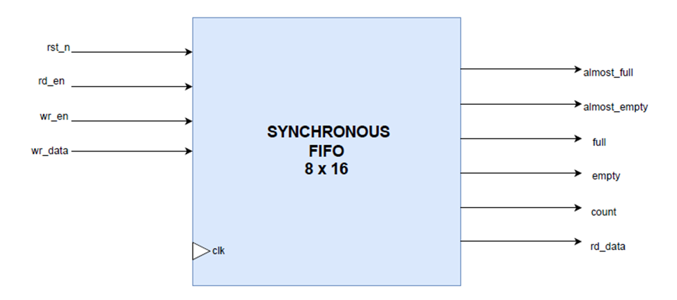

#  Synchronous FIFO

## Introduction  
A First-In-First-Out (FIFO) buffer is a sequential memory structure that stores data in the order it is written and allows data to be read in the same order.  
This lab implements a  **synchronous FIFO** with configurable data width, depth, and almost-full/almost-empty thresholds.  
Because it operates within a single clock domain, the design is simple and efficient.

---

## Interface Signals  

### Inputs  
- clk: System clock (synchronous domain).  
- rst_n: Active-low reset; clears FIFO state.  
- wr_en: Write enable; pushes data if FIFO not full.  
- rd_en: Read enable; pops data if FIFO not empty.  
- din [DATA_WIDTH-1:0]: Data input for writes.  

### Outputs  
- dout [DATA_WIDTH-1:0]: Data output for reads.  
- full: High when FIFO is full.  
- empty: High when FIFO is empty.  
- almost_full: High when count ≥ ALMOST_FULL_THRESHOLD.  
- almost_empty: High when count ≤ ALMOST_EMPTY_THRESHOLD and > 0.  
- count [log2(FIFO_DEPTH):0]: Number of stored elements.  

---

## FIFO Architecture  

### Components  
- **Memory Array**: `logic [DATA_WIDTH-1:0] mem [0:FIFO_DEPTH-1]` stores the data.  
- **Write Pointer**: Increments when `wr_en` is high and FIFO not full.  
- **Read Pointer**: Increments when `rd_en` is high and FIFO not empty.  
- **Count Register**: Tracks the number of elements, updated on writes and reads.  

### Operation  
- **Write**: Data written at `wr_ptr`, then pointer and count updated.  
- **Read**: Data read from `rd_ptr`, then pointer and count updated.  
- **Flow Control**: Flags guide when producer/consumer should pause or resume.  

---

## Problem  
Design a synchronous FIFO that can buffer data in a single-clock domain with configurable width and depth, while providing status flags for empty, full, and programmable threshold conditions.  

---

## Approach  
The FIFO is implemented using:  
- A memory array (`mem`) to store data.  
- Write and read pointers that increment modulo the FIFO depth.  
- A counter to track the number of stored elements.  
- Flags (empty, full, almost-empty, almost-full) generated based on the counter value.  

This ensures proper sequencing of data and allows the system to react before reaching critical conditions.  

---

## Examples  

  

### Example 1: Read Until Empty  
- With FIFO  read 8 values with `rd_en=1`.  
- Data comes out in the same order it was written.  
- After 8 reads, `empty=1`, `count=0`.  

### Example 2: Thresholds  
- FIFO depth = 16, ALMOST_FULL_THRESHOLD=12.  
- After 12 writes, `almost_full=1`.  
- After reading down to ≤2, `almost_empty=1`.  

---

## AI Usage  
- Used AI to reformat original file into Markdown.  
- Used AI to understand conditions for flags and how to implement them.

---

