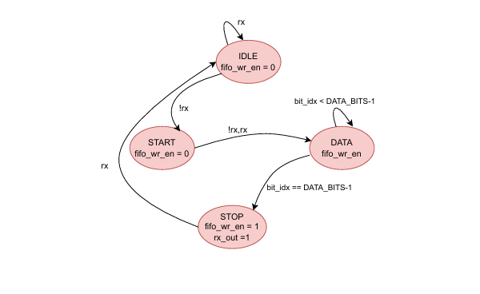

##  UART Receiver  

## Introduction  
The UART (Universal Asynchronous Receiver/Transmitter) receiver converts a serial input signal (`rx`) into parallel data.  
Since UART does not share a clock between transmitter and receiver, synchronization is achieved using a **baud rate generator**.  
To prevent data loss when the CPU/system is busy, a **FIFO buffer** stores received data until it is read.  

---

## Interface Signals  

### Inputs  
- clk: System clock.  
- rst_n: Active-low reset.  
- rx: Serial input line.  
- rd_en: Read enable for FIFO.  

### Outputs  
- rx_out [7:0]: Parallel received data.  
- rx_valid: Indicates new valid data is available.  
- fifo_full: High when FIFO is full.  
- fifo_empty: High when FIFO is empty.  
- frame_error: High when stop bit check fails.  

---

## UART Frame Structure  
- Start bit: 1 bit low (0).  
- Data bits: Typically 8 bits, LSB first.  
- Stop bit(s): 1 or 2 bits high (1).  

---

## Receiver FSM  

### States  
1. **Idle**: Line held high; wait for falling edge (start bit).  
2. **Start**: Validate start bit at baud tick.  
3. **Data**: Shift in 8 data bits, one per baud tick (LSB first).  
4. **Stop**: Check stop bit. If valid, write received word into FIFO.  
   
   

### State Table  

| Current State | rx (serial input) | Outputs                   | Next State |
|---------------|-------------------|---------------------------|------------|
| Idle          | 1                 | fifo_wr_en=0              | Idle       |
| Idle          | 0                 | fifo_wr_en=0              | Start      |
| Start         | 0                 | fifo_wr_en=0              | Data       |
| Start         | 1                 | fifo_wr_en=0              | Idle       |
| Data          | 0/1               | fifo_wr_en=0              | Data/Stop  |
| Stop          | 1                 | fifo_wr_en=1, latch data  | Idle       |
| Stop          | 0                 | fifo_wr_en=0 (error)      | Idle       |

---
## Problem  
Design a UART receiver that can reliably detect and decode incoming UART frames, convert serial input into parallel data, and store results in a FIFO for safe retrieval by the system.  

---

## Approach  
The receiver design integrates:  
- **Baud Rate Generator**: Divides system clock to generate baud ticks.    
- **Receiver FSM**: Detects start bit, shifts in data bits, checks stop bit, and pushes data into FIFO.  
- **FIFO Buffer**: Stores received data until read, preventing loss during CPU delays.  
- **Data Register**: Captures output data when read, with `rx_valid` flag indicating new data availability.  

---

## Examples  

### Example 1: Valid Frame Reception  
- Serial input: **Start(0) + 10100101 (LSB first) + Stop(1)**.  
- FSM shifts bits into shift register.  
- At stop bit=1, data=0xA5 pushed into FIFO, `rx_valid=1`.  

### Example 2: Framing Error  
- Serial input: **Start(0) + 11110000 + Stop(0)**.  
- Stop bit check fails → `frame_error=1`.  
- Data not written to FIFO.  

### Example 3: FIFO Storage  
- Burst of 4 characters received back-to-back.  
- Each valid frame pushed into FIFO.  
- CPU reads later using `rd_en`, one byte at a time.  

---

## AI Usage  
- Used AI to reformat original notes into Markdown.  
   
 

---

