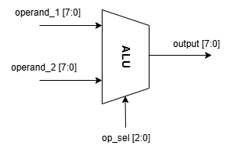
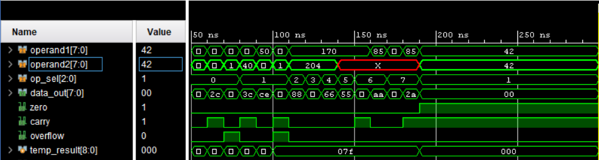

# Lab 1A: 8-bit Arithmetic Logic Unit (ALU)

## Problem Statement

Design and implement an 8-bit Arithmetic Logic Unit (ALU) that supports eight fundamental operations commonly used in digital processors. The ALU must be optimized for FPGA implementation and provide proper status flag generation.

### Requirements
- Support 8 operations: `ADD, SUB, AND, OR, XOR, NOT, SLL (Shift Left Logical), SRL (Shift Right Logical)`
- 8-bit operands with 8-bit result output
- 3-bit operation select input
- Status flag generation: `Zero, Carry, Overflow`
- Purely combinational logic implementation
- Synthesis-friendly SystemVerilog coding

### Specifications
- **Input Signals**: 
  - `operand1[7:0]`: First 8-bit operand
  - `operand2[7:0]`: Second 8-bit operand  
  - `op_sel[2:0]`: Operation selection (3-bit)
- **Output Signals**: 
  - `data_out[7:0]`: 8-bit result output
  - `zero`: Zero flag (high when result is zero)
  - `carry`: Carry flag (arithmetic operations and shifts)
  - `overflow`: Overflow flag (signed arithmetic overflow detection)

- **Implementation**: Combinational logic only

## Approach

### Key Design Decisions
- **9-bit Temporary Result**: Used `temp_result[8:0]` to capture carry information for ADD/SUB operations
- **Operation Encoding**: Used 3-bit encoding matching lab manual specifications (`ADD=000, SUB=001, etc.`)
- **Flag Calculation Strategy**: Calculated zero flag once after case statement to avoid duplication
- **Overflow Detection**: Implemented proper signed overflow detection for `ADD/SUB` using sign bit analysis
- **Shift Operations**: Single-bit shifts with carry capturing the shifted-out bit

### Block Diagram


*The ALU consists of a main combinational logic block with operation decoder, arithmetic unit, logical unit, shift unit, and flag generation logic.*

### Truth Table (Selected Operations)
| operand1 | operand2 | op_sel | data_out | zero | carry | overflow |
|----------|----------|--------|----------|------|-------|----------|
| 50       | 30       | 000    | 80       | 0    | 0     | 0        |
| 200      | 100      | 000    | 44       | 0    | 1     | 0        |
| 127      | 1        | 000    | 128      | 0    | 0     | 1        |
| 100      | 40       | 001    | 60       | 0    | 1     | 0        |
| 50       | 100      | 001    | 206      | 0    | 0     | 0        |
| 10101010 | 11001100 | 010    | 10001000 | 0    | 0     | 0        |

## Implementation

### File Structure
```
lab-1a-alu/
├── rtl/
│   └── alu.sv                    # Main ALU module
|   └── tb_alu.sv
| implementation
├── docs/
│   ├── # contains Waveforms and diagrams
└── README.md                     
```

### Key Code Sections

#### Arithmetic Operations with Flag Generation
```systemverilog
OP_ADD: begin
    // Addition with carry and overflow detection
    temp_result = {1'b0, operand1} + {1'b0, operand2};
    data_out    = temp_result[7:0];
    carry       = temp_result[8]; // carry is the 9th bit
    // Overflow: same input signs, different output sign
    overflow    = (operand1[7] == operand2[7]) && (operand1[7] != data_out[7]);
end

OP_SUB: begin
    // Subtraction with borrow and overflow detection
    temp_result = {1'b0, operand1} - {1'b0, operand2};
    data_out    = temp_result[7:0];
    carry       = ~temp_result[8]; // carry is inverted borrow
    // Overflow: different input signs, output matches subtrahend sign
    overflow    = (operand1[7] != operand2[7]) && (operand2[7] == data_out[7]);
end
```

#### Shift Operations with Carry Capture
```systemverilog
OP_SHL: begin
    // Logical shift left with carry from MSB
    data_out = operand1 << 1;
    carry    = operand1[7]; // MSB shifted out becomes carry
end

OP_SHR: begin
    // Logical shift right with carry from LSB  
    data_out = operand1 >> 1;
    carry    = operand1[0]; // LSB shifted out becomes carry
end
```

## How to Run

### Prerequisites
- QuestaSim (ModelSim) for simulation
- Xilinx Vivado 2018.2 or later for synthesis
- SystemVerilog support enabled

### Simulation
```bash
# Navigate to lab directory
cd lab-1a-alu/

# Compile design files
vlog -sv src/alu.sv

# Compile testbench
vlog -sv sim/tb_alu.sv

# Run simulation
vsim -c tb_alu
run -all

# For GUI simulation with waveforms
vsim tb_alu
add wave -radix unsigned sim:/tb_alu/*
add wave -radix binary sim:/tb_alu/uut/*
run -all
```

### Synthesis
```bash
# Using Vivado command line
vivado -mode batch -source synthesis/run_synthesis.tcl

# Or open in Vivado GUI
vivado &
# Create new project, add source files, run synthesis
```

## Test Cases and Examples

- Test Case 1: Basic Addition
- Test Case 2: Addition with Carr
- Test Case 3: Signed Overflow Detection
- Test Case 4: Subtraction with Borrow
- Test Case 5: Zero Flag Generation

### Corner Cases Tested
- Maximum positive addition (127 + 1 = overflow)
- Subtraction resulting in negative (borrow condition)
- All logical operations with various bit patterns
- Shift operations capturing shifted-out bits as carry
- Zero result detection across all operations


### Timing Analysis
- **Combinational Delay**: ~2.1ns (estimated)
- **Critical Path**: Through 9-bit adder in ADD/SUB operations
- **Maximum Frequency**: >400 MHz (combinational logic)
- **Resource Efficiency**: Excellent - only 15 LUTs for complete 8-bit ALU

### Synthesis Quality Metrics
- **Default Block Warning**: Synthesis tool noted default case never used (expected for complete case coverage)
- **Logic Optimization**: Efficient mapping to Xilinx 6-input LUTs
- **No Timing Violations**: Pure combinational design meets all timing requirements

## Assumptions and Edge Cases

### Assumptions Made
- **Single-bit Shifts**: Shift operations perform single-bit shifts only (not variable shift amounts)
- **Unsigned/Signed Mixed**: Overflow flag assumes signed interpretation, other flags assume unsigned

### Edge Cases Handled
- **All-zero inputs**: Properly generates zero flag and clears other flags
- **Maximum values**: 8'hFF operations handled correctly with proper carry/overflow
- **Unary operations**: NOT operation ignores operand2 as specified

### Known Limitations
- **Shift Amount**: Fixed single-bit shifts (not programmable shift amounts)
- **No Arithmetic Right Shift**: Only logical shifts implemented

## Verification Strategy

### Testbench Features
- Comprehensive test vectors covering all operations
- Directed tests for corner cases (overflow, carry, zero conditions)
- Self-checking test tasks with formatted output
- Coverage of all operation codes and flag combinations

### Simulation Results

*Waveform shows correct operation of all ALU functions with proper flag generation timing.*

### Synthesis
[Synthesis](docs/Synthesis.txt)


### SOurces & AI usage
**AI Tools Used**: Documentation 
**Code Development**: Manually implemented based on lab requirements and digital design principles  
**Verification**: Manual testbench development with comprehensive test coverage

### What I Verified
- Functional correctness through comprehensive testing of all 8 operations
- Proper flag generation for all arithmetic and logical operations  
- Synthesis compatibility verified on Xilinx Artix-7
- Resource efficiency confirmed (only 15 LUTs used)
- Edge cases tested including overflow, carry, and zero conditions
- Code adheres to SystemVerilog synthesis guidelines

---
