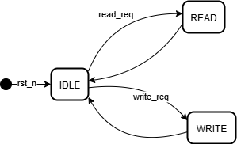
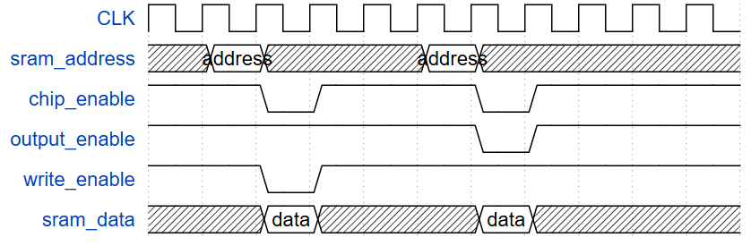
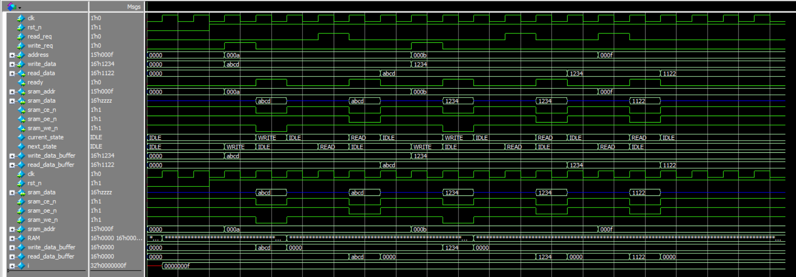

# Lab 6A: Synchronous SRAM Controller

## Problem Statement

Design and implement a controller for interfacing with synchronous SRAM memory. The controller must manage read and write operations, handle bidirectional data bus control, and provide proper timing for SRAM interface signals while maintaining data integrity.

### Requirements
- Interface to synchronous SRAM with proper timing
- Support read and write operations
- Bidirectional data bus management
- Control signal generation (CE, OE, WE)
- Ready signal for operation completion
- Single-cycle read/write operation capability

### Specifications
- **Input Signals**: 
  - `clk`: System clock
  - `rst_n`: Active-low asynchronous reset
  - `read_req`: Read operation request
  - `write_req`: Write operation request
  - `address[14:0]`: Memory address (32K addresses)
  - `write_data[15:0]`: Data to write to memory
- **Output Signals**: 
  - `read_data[15:0]`: Data read from memory
  - `ready`: Operation completion flag
- **SRAM Interface**: 
  - `sram_addr[14:0]`: SRAM address bus
  - `sram_data[15:0]`: Bidirectional SRAM data bus
  - `sram_ce_n`: Chip Enable (active low)
  - `sram_oe_n`: Output Enable (active low)
  - `sram_we_n`: Write Enable (active low)
- **Implementation**: FSM-based control with proper timing

## Approach

### Design Methodology
1. **FSM-Based Control**: Three-state FSM managing IDLE, READ, and WRITE operations
2. **Bidirectional Bus Management**: Proper tri-state control for data bus
3. **Single-Cycle Operations**: Fast read/write with immediate ready assertion
4. **Data Buffering**: Internal buffering for read data stability
5. **Modular Architecture**: Separate controller and SRAM model for testing

### Key Design Decisions
- **Three-State FSM**: IDLE → READ/WRITE → IDLE for simple operation flow
- **Immediate Ready**: Single-cycle operations with ready asserted during active state
- **Tri-State Logic**: Careful management of bidirectional data bus
- **Data Latching**: Read data captured and held for stable output
- **Address Pass-Through**: Direct address connection for minimal delay

### System Block Diagram


### SRAM Controller


### Timing Diagram


*Read: CE↓, OE↓, WE↑ → Data Valid*
*Write: CE↓, OE↑, WE↓ → Data Latched*

## Implementation

### File Structure
```
lab6a_synch_SRAM_cntrlr/
├── rtl/
│   ├── top.sv                    # Top-level integration
│   ├── controller.sv             # SRAM controller FSM
│   ├── SRAM.sv                   # SRAM memory model
│   └── tb_SRAM.sv                # Testbench
├── docs/
│   ├── Top_SRAM_block_diagram.png       # System diagram
│   ├── SRAM.drawio.png                  # SRAM controller
│   ├── SRAM_timing_diagram.png          # Timing analysis
│   ├── SRAM_waveform.png               # Simulation results
│   └── Synthesis.txt                   # Synthesis report
└── README.md
```

### Key Code Sections

#### FSM State Control
```systemverilog
typedef enum logic [1:0] {
    IDLE  = 2'b00,
    READ  = 2'b01,
    WRITE = 2'b10
} state_t;

// State transitions
IDLE: begin
    if(read_req) begin
        next_state = READ;
    end
    else if(write_req) begin
        next_state = WRITE;
    end
end

READ: begin
    sram_ce_n = 0;  // Chip enable active
    sram_oe_n = 0;  // Output enable (SRAM drives bus)
    sram_we_n = 1;  // Write disable
    ready     = 1;  // Single-cycle operation
    next_state = IDLE;
end
```

#### Bidirectional Data Bus Control
```systemverilog
// Tri-state driver for write operations
assign sram_data = (!sram_ce_n && sram_oe_n && !sram_we_n) ? 
                   write_data_buffer : 16'hzzzz;

// Read data capture
always_ff @(posedge clk or negedge rst_n) begin
    if (!rst_n) begin
        read_data_buffer <= 16'b0;
    end
    else if (!sram_ce_n && !sram_oe_n && sram_we_n) begin
        read_data_buffer <= sram_data;  // Capture read data
    end
end
```

#### SRAM Memory Model
```systemverilog
// Internal memory array
logic [15:0] RAM [0:15];  // Small array for testing

// Write operation
always_ff @(posedge clk) begin
    if(!rst_n) begin
        // Initialize memory with test pattern
        for(i = 0; i < 16; i++) begin
            RAM[i] <= 16'b0;
        end
        RAM[15] <= 16'h1122;  // Test value
    end
    else if(!sram_ce_n && !sram_we_n && sram_oe_n) begin
        RAM[sram_addr] <= write_data_buffer;
    end
end
```

## How to Run

### Prerequisites
- QuestaSim (ModelSim) for simulation
- Xilinx Vivado for synthesis
- SystemVerilog support enabled

### Simulation
```bash
# Navigate to lab directory
cd lab6a_synch_SRAM_cntrlr/

# Compile all modules
vlog -sv rtl/top.sv rtl/controller.sv rtl/SRAM.sv rtl/tb_SRAM.sv
vsim -c tb_SRAM
run -all

# GUI simulation
vsim tb_SRAM
run -all
```

### Synthesis
Used GUI in VIVADO

## Test Cases and Examples

### Test Cases Covered
- Reset functionality verification
- Single write operation
- Single read operation (read-after-write)
- Multiple address testing
- Data integrity verification
- Control signal timing
- Ready flag operation
- Bidirectional bus functionality

## Verification Strategy

### Testbench Features
- Complete read/write operation testing
- Data integrity verification
- Multiple address testing
- Control signal timing verification
- Ready flag functionality validation

### Simulation Results


### Synthesis Results
[Synthesis Report](docs/Synthesis.txt)


## Design Notes

### Implementation Challenges
- **Bidirectional Bus**: Careful tri-state logic to prevent bus conflicts
- **Timing Coordination**: Proper setup/hold time management for SRAM interface
- **Data Stability**: Ensuring read data remains stable after capture
- **Single-Cycle Operation**: Balancing speed with proper SRAM timing

### Interface Considerations
- **SRAM Compatibility**: Designed for standard synchronous SRAM timing
- **Bus Contention Prevention**: Proper tri-state control prevents conflicts
- **Data Integrity**: Read data buffering ensures stable outputs

### Alternative Approaches Considered
- **Multi-Cycle Operations**: Rejected for performance reasons
- **Separate Read/Write FSMs**: Current unified approach simpler and efficient

## Assumptions and Edge Cases

### Assumptions Made
- SRAM has single-cycle access time
- Request signals are properly synchronized
- No burst operations required

### Edge Cases Handled
- Simultaneous read/write requests (priority to first detected)
- Reset during active operation
- Data bus conflicts (prevented by tri-state control)

### Known Limitations
- Single-cycle operation only (no wait states)
- Limited memory size in test model (16 words)
- No burst mode support
- No error detection/correction

## Sources & AI Usage

**AI Tools Used**: Documentation assistance  
**Code Development**: Manual implementation following SRAM interface standards

### What I Verified
- Proper SRAM control signal generation
- Bidirectional data bus management
- Single-cycle read/write operations

---