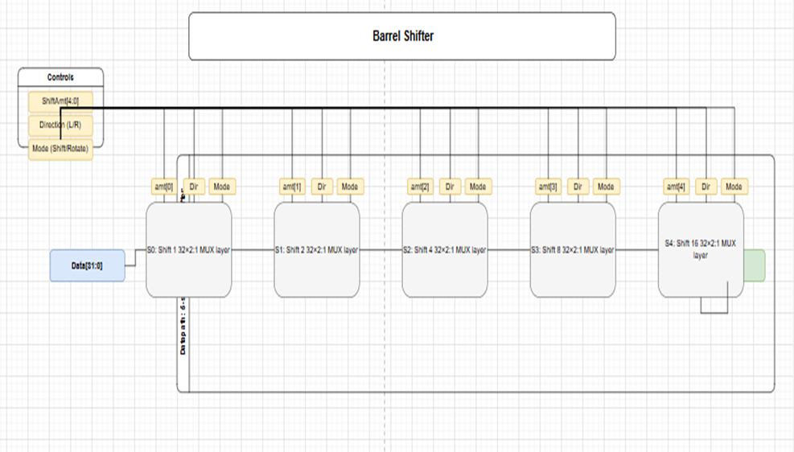

# 32-bit Barrel Shifter

## Introduction
A **barrel shifter** is a combinational digital circuit designed to shift or rotate data by a specified number of positions in a single clock cycle. Unlike sequential shifters that require multiple cycles, a barrel shifter completes the operation in one cycle, making it highly efficient.

In this project, a **32-bit barrel shifter** was implemented with:  
- 32-bit data input and output  
- 5-bit shift amount (`0–31`)  
- Direction control: left or right  
- Mode control: shift or rotate  
---
 

---

## Barrel Shifter Operations

### Shift Operations
- **Logical Shift Left (LSL):** Moves bits left, LSBs filled with `0`.  
- **Logical Shift Right (LSR):** Moves bits right, MSBs filled with `0`.  

### Rotate Operations
- **Rotate Left (ROL):** Bits shifted out of MSB wrap to LSB.  
- **Rotate Right (ROR):** Bits shifted out of LSB wrap to MSB.  

---

## Architecture

The barrel shifter uses **5 stages**, each controlled by one bit of the shift amount.  

| Stage | Shift Amount | Purpose                  |
|-------|--------------|--------------------------|
| 0     | 1            | If `shift_amt[0] = 1`    |
| 1     | 2            | If `shift_amt[1] = 1`    |
| 2     | 4            | If `shift_amt[2] = 1`    |
| 3     | 8            | If `shift_amt[3] = 1`    |
| 4     | 16           | If `shift_amt[4] = 1`    |

- **Shift mode:** Vacant bits are filled with `0`.  
- **Rotate mode:** Vacant bits are filled by wrapping shifted-out bits.  
- Implemented combinationally with multiplexers; no sequential elements are required.  

---

## Problem
Design and document a **32-bit barrel shifter** capable of performing both shifts and rotates in one cycle. The circuit should handle left/right direction control, shift/rotate mode, and variable shift amounts (`0–31`).  

---

## Approach
- Use **multi-stage design** (shifts by powers of 2).  
- Combine stages to achieve any shift amount.  
- Use **multiplexers** to select between shifted and unshifted data.  
- Use control signals:  
  - `shift_rotate` → 0 = shift, 1 = rotate  
  - `left_right` → 0 = left, 1 = right  

---

## Examples

### Example 1:  Shift Left
- **Input A:** `32'h0000_0001`  
- **Shift amount:** `2`  
- **Mode:** shift (`0`)  
- **Direction:** left (`0`)  

**Result:** `0000_0004`

---

### Example 2: Shift Right
- **Input A:** `32'h8000_0000`  
- **Shift amount:** `3`  
- **Mode:** shift (`0`)  
- **Direction:** right (`1`)  

**Result:** `1000_0000`

---

### Example 3: Rotate Left
- **Input A:** `32'h8000_0001`  
- **Shift amount:** `1`  
- **Mode:** rotate (`1`)  
- **Direction:** left (`0`)  

**Result:** `0000_0003`

---

### Example 4: Rotate Right
- **Input A:** `32'h8000_0001`  
- **Shift amount:** `1`  
- **Mode:** rotate (`1`)  
- **Direction:** right (`1`)  

**Result:** `C000_0000`

---

## AI Usage
- Used AI to help convert word file  into Markdown `README.md`.  
- Verified  shift/rotate .  
  

---

