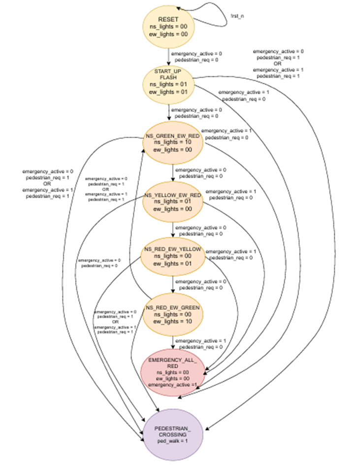

##  Traffic Light Controller  

## Introduction  
This lab focuses on designing a traffic light controller for a four-way intersection using a finite state machine (FSM).  
The controller manages north-south and east-west traffic lights, pedestrian crossing requests, and emergency overrides.  
By modeling the problem as an FSM, the system ensures safe, predictable, and efficient traffic flow while responding correctly to special conditions.  

---

## Interface Signals  

### Inputs  
- clk: 1 Hz system clock for FSM timing.  
- rst_n: Active-low asynchronous reset; initializes FSM to all-red safe state.  
- emergency: Emergency override; forces all lights red (flashing).  
- pedestrian_req: Pedestrian crossing request; initiates pedestrian walk cycle.  

### Outputs  
- ns_lights [1:0]: North-South traffic lights  
  - 01 = Red, 10 = Yellow, 11 = Green  
- ew_lights [1:0]: East-West traffic lights  
  - 01 = Red, 10 = Yellow, 11 = Green  
- ped_walk: Pedestrian walk signal (1 = walk, 0 = stop).  
- emergency_active: High when FSM is in emergency override state.  

---

## FSM Description  

### States  
- IDLE: Reset/initial safe state.  
- STARTUP_FLASH: All red flashing for initialization.  
- NS_GREEN_EW_RED: North-South green, East-West red.  
- NS_YELLOW_EW_RED: North-South yellow, East-West red.  
- NS_RED_EW_GREEN: North-South red, East-West green.  
- NS_RED_EW_YELLOW: North-South red, East-West yellow.  
- PEDESTRIAN_CROSSING: Pedestrian walk signal, all vehicle lights red.  
- EMERGENCY_ALL_RED: All signals red (flashing) for emergencies.  

### Transition Rules  
- IDLE → STARTUP_FLASH: on reset release.  
- STARTUP_FLASH → NS_GREEN_EW_RED: if no emergency or pedestrian request.  
- Green states last 30 cycles, yellow lasts 5 cycles.  
- Pedestrian crossing and emergency phases last 30 cycles.  
- Any traffic state → EMERGENCY_ALL_RED: if emergency=1.  
- Any traffic state → PEDESTRIAN_CROSSING: if pedestrian_req=1.  
- Emergency/Pedestrian phases return to the **previous traffic state** once done.  

---

## State Transition Table  

| Current State         | Condition                  | Next State             | Duration (cycles) |
|-----------------------|---------------------------|------------------------|-------------------|
| IDLE                  | rst_n=1                   | STARTUP_FLASH          | -                 |
| STARTUP_FLASH         | no emergency/pedestrian   | NS_GREEN_EW_RED        | -                 |
| NS_GREEN_EW_RED       | after 30                  | NS_YELLOW_EW_RED       | 30                |
| NS_YELLOW_EW_RED      | after 5                   | NS_RED_EW_GREEN        | 5                 |
| NS_RED_EW_GREEN       | after 30                  | NS_RED_EW_YELLOW       | 30                |
| NS_RED_EW_YELLOW      | after 5                   | NS_GREEN_EW_RED        | 5                 |
| Any state             | emergency=1               | EMERGENCY_ALL_RED      | 30               |
| Any state             | pedestrian_req=1          | PEDESTRIAN_CROSSING    | 30                |
| EMERGENCY_ALL_RED     | done/emergency=0          | prev_state             | 30                |
| PEDESTRIAN_CROSSING   | done/ped_req=0            | prev_state             | 30               |

---

## Approach  
The design is implemented as a synchronous FSM with clearly defined states and timers.  
- A 1 Hz system clock drives timing (seconds = cycles).  
- A counter defines how long the FSM stays in each state (green, yellow, pedestrian, emergency).  
- Transitions are condition-based: timed expirations, emergency signal, or pedestrian request.  
- Priority is given to **emergency > pedestrian > normal traffic**.  
- The FSM resumes from the previous traffic state after pedestrian or emergency phases.  

---
## Examples  

### Example 1: Normal Operation  
- No pedestrian or emergency signals.  
- FSM cycles:  
  - NS Green (30s) → NS Yellow (5s) → EW Green (30s) → EW Yellow (5s).  
- Sequence repeats indefinitely.  

### Example 2: Pedestrian Request During NS Green  
- At 10s into NS Green, pedestrian_req=1.  
- FSM interrupts → Pedestrian Crossing (30s).  
- After walk phase, FSM resumes NS Green.  

### Example 3: Emergency Override During EW Green  
- At 20s into EW Green, emergency=1.  
- FSM enters Emergency All Red (30s flashing).  
- Once emergency clears, FSM resumes EW Green. 

---

## AI Usage  
- Used AI to reformat Word notes into Markdown.  
---

