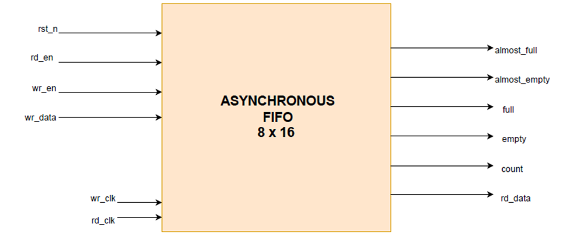

# Lab: Asynchronous FIFO

## Introduction  
An asynchronous FIFO is designed to safely transfer data between two different clock domains.  
Unlike a synchronous FIFO, write and read operations occur on independent clocks (`wr_clk`, `rd_clk`).  
This design uses Gray-coded pointers and multi-flop synchronizers to handle clock domain crossing without data corruption or metastability.  

---

## Interface Signals  

### Inputs  
- wr_clk: Write clock.  
- rd_clk: Read clock.  
- rst_n: Active-low reset for both domains.  
- wr_en: Write enable; pushes data if FIFO not full.  
- rd_en: Read enable; pops data if FIFO not empty.  
- din [DATA_WIDTH-1:0]: Data input for write operations.  

### Outputs  
- dout [DATA_WIDTH-1:0]: Data output for read operations.  
- full: Asserted when FIFO is full (write domain).  
- empty: Asserted when FIFO is empty (read domain).  
- almost_full: Asserted when count ≥ ALMOST_FULL_THRESHOLD.  
- almost_empty: Asserted when count ≤ ALMOST_EMPTY_THRESHOLD.  

---

## Architecture  

### Memory Array  
- Stores data words. Indexed by binary write and read pointers.  

### Write Pointer  
- `wr_ptr_bin` increments on writes (wr_en && !full).  
- Converted to Gray code (`wr_ptr_gray`) for synchronization into the read domain.  

### Read Pointer  
- `rd_ptr_bin` increments on reads (rd_en && !empty).  
- Converted to Gray code (`rd_ptr_gray`) for synchronization into the write domain.  

### Pointer Synchronization  
- Multi-flop synchronizers ensure Gray-coded pointers are safely transferred across domains.  
- Example: `rd_ptr_gray_sync1 → rd_ptr_gray_sync2` in the write clock domain.  

### Gray-to-Binary Conversion  
- Synchronized Gray pointers are converted back to binary.  
- Binary values are used to compute FIFO occupancy and generate flags.  

### Flags  
- Full / Almost-full: Calculated in the write domain using synchronized read pointer.  
- Empty / Almost-empty: Calculated in the read domain using synchronized write pointer.  

---

## FIFO Operation  

- **Write Domain**  
  - On `wr_en` and not full, data is written at `wr_ptr_bin`.  
  - Write pointer increments, Gray code updated, synchronized read pointer used for occupancy check.  

- **Read Domain**  
  - On `rd_en` and not empty, data is read from `rd_ptr_bin`.  
  - Read pointer increments, Gray code updated, synchronized write pointer used for occupancy check.  

- **Cross-Domain Synchronization**  
  - Gray-coded pointers transferred across domains using multi-flop synchronizers.  
  - Gray-to-binary conversion ensures safe arithmetic for flag generation.  

---
## Problem  
Design an asynchronous FIFO that supports data transfer between two independent clock domains.  
The FIFO must generate accurate full, empty, almost-full, and almost-empty flags despite unsynchronized clocks.  

---

## Approach  
The asynchronous FIFO is implemented using:  
- A **memory array** to store data words.  
- **Binary write and read pointers** (`wr_ptr_bin`, `rd_ptr_bin`) to track positions.  
- **Gray-coded pointers** for safe synchronization across domains.  
- **Pointer synchronizers** (multi-flop registers) to safely sample opposite domain pointers.  
- **Gray-to-binary conversion** to calculate counts and flags.  
- **Parameterizable thresholds** for almost-full and almost-empty conditions.  

--- 

## Examples  

### Example 1: Safe Write  
- wr_clk = 50 MHz, rd_clk = 25 MHz.  
- Writes occur at every wr_clk cycle, reads occur slower.  
- FIFO fills until `full=1`, preventing further writes.  

### Example 2: Safe Read  
- wr_clk slower than rd_clk.  
- Reads continue until synchronized write pointer catches up.  
- When all data is consumed, `empty=1`.  

### Example 3: Threshold Warnings  
- FIFO depth = 16, ALMOST_FULL_THRESHOLD = 12.  
- At 12 writes, `almost_full=1`.  
- As FIFO drains to ≤2, `almost_empty=1`.  

---

## AI Usage  
- Used AI to reformat word file into Markdown.  
- used AI for gray to binary conversion and also for synchronization. 
 

---

