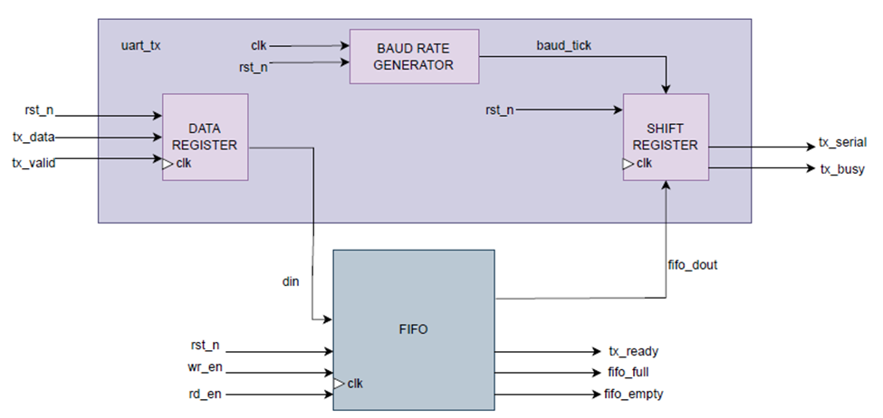
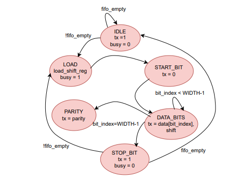

 
##  UART Transmitter  

## Introduction  
The UART (Universal Asynchronous Receiver/Transmitter) is a serial communication protocol widely used in digital systems.  
This lab implements a **UART transmitter** with configurable baud rate, FIFO , and flow-control flags.  
The design uses a **finite state machine (FSM)** and a **shift register** to reliably transmit data bits in the correct UART frame format.  

---

## Interface Signals  

### Inputs  
- clk: System clock.  
- rst_n: Active-low reset.  
- tx_data [7:0]: Data byte to transmit.  
- wr_en: Write enable for FIFO.  
- baud_div [15:0]: Baud rate divisor.  

### Outputs  
- tx_serial: Serial transmit output line.  
- tx_ready: High when FIFO can accept new data.  
- tx_busy: High when transmitter is actively sending data.  

---

## Transmit State Machine  

### States  
- **Idle**: Wait for FIFO data, tx_serial=1.  
- **Load**: Load data from FIFO into shift register.  
- **Start_bit**: Transmit start bit (0).  
- **Data_bits**: Shift out 8 data bits, LSB first.  
- **Parity**: Transmit parity bit (if enabled).  
- **Stop_bit**: Transmit stop bit (1), then return to IDLE or LOAD.  
  

### State Table  

| Current State | Input Condition | Next State   | Outputs                  |
|---------------|----------------|--------------|--------------------------|
| Idle          | fifo_empty     | Idle         | tx=1, busy=0             |
| Idle          | !fifo_empty    | Load         | tx=1, busy=0             |
| Load          | always         | Start_bit    | busy=1                   |
| Start_bit     | baud_tick      | Data_bits    | tx=0                     |
| Data_bits     | bit_index < 7  | Data_bits    | tx=data[bit_index], shift|
| Data_bits     | bit_index = 7  | Parity/Stop  | tx=data[7]               |
| Parity        | baud_tick      | Stop_bit     | tx=parity_bit            |
| Stop_bit      | fifo_empty     | Idle         | tx=1, busy=0             |
| Stop_bit      | !fifo_empty    | Load         | tx=1, busy=0             |

---
## Problem  
Design a UART transmitter that converts parallel data into serial form, supporting:  
- Configurable baud rates.  
- FIFO buffering for multiple bytes.  
- Standard UART frame format (start bit, 8 data bits, optional parity, stop bit).  
- Status flags for flow control.  

---

## Approach  
The design integrates:  
- **Baud Rate Generator**:  
  - Divider: `div = clk_freq / baud_rate`.  
  - Produces a tick per bit interval to ensure correct timing.  

- **UART Frame Format**:  
  - Start bit: 1 low (0).  
  - Data bits: 8 bits, LSB first.  
  - Parity bit: even/odd (optional).  
  - Stop bit: 1 high (1).  

- **Transmit FSM**:  
  - IDLE → LOAD → START_BIT → DATA_BITS → PARITY → STOP_BIT → back to IDLE/LOAD.  
  - FSM ensures proper sequencing of each frame element.  

- **FIFO Buffer**:  
  - Stores multiple data bytes before transmission.  
  - `tx_ready` indicates FIFO can accept new data.  
  - Data is popped from FIFO when FSM enters LOAD state.  

- **Shift Register**:  
  - Loads parallel byte, shifts out bits serially (LSB first).  

---
## Examples  

### Example 1: Single Byte Transmission  
- tx_data = `0xA5` (10100101).  
- Frame sent: **Start(0) + 10100101 (LSB first) + Stop(1)**.  

### Example 2: With Parity  
- tx_data = `0x3C` (00111100), even parity enabled.  
- Frame sent: **Start(0) + 00111100 + Parity(0) + Stop(1)**.  

### Example 3: Continuous Transmission with FIFO  
- FIFO loaded with 3 bytes: `0x55, 0xAA, 0xFF`.  
- Frames sent back-to-back with no idle gaps.  
- `tx_ready=0` during transmission, asserted again after FIFO drains.  

---

## AI Usage  
- Used AI to format original notes into structured Markdown.  
-To correct some logical errors.
---

