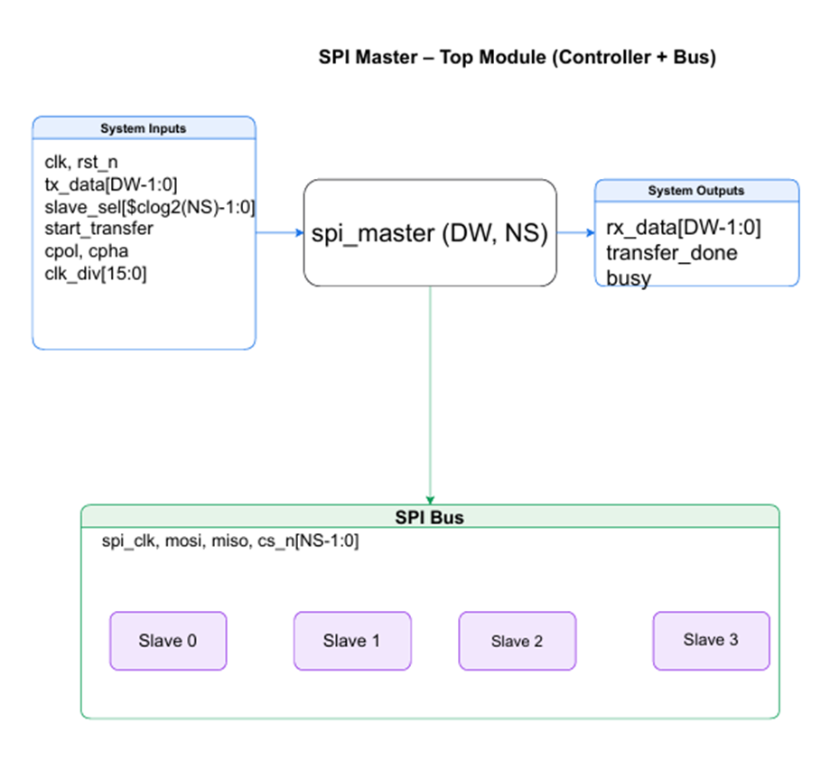
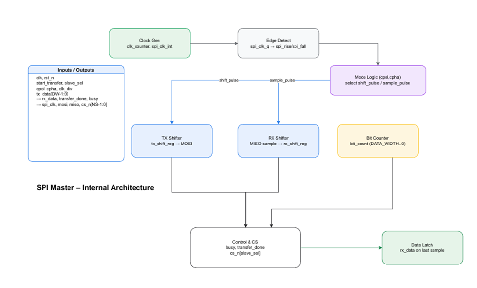
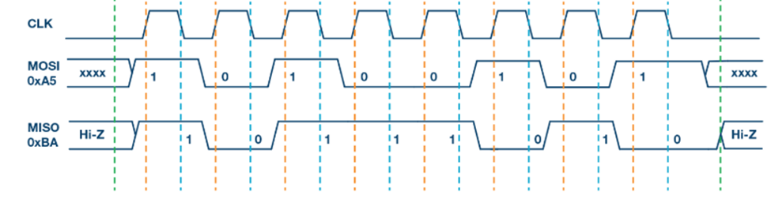
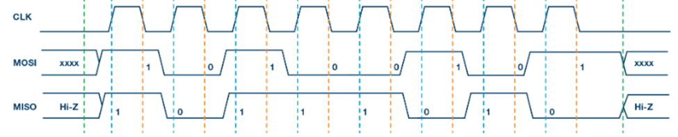
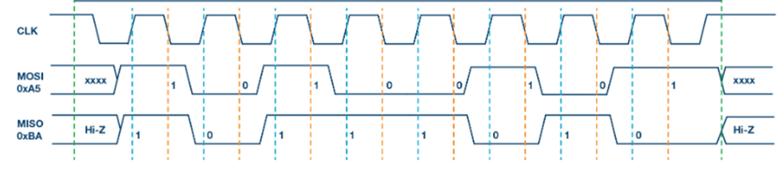
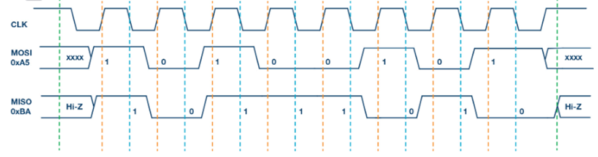

#  SPI Controller

## Introduction
The Serial Peripheral Interface (SPI) is a synchronous serial communication protocol widely used for short-distance communication between microcontrollers and peripheral devices such as sensors, displays, and memory chips.  
This lab focuses on designing an SPI **Master Controller**, which generates the SPI clock, manages chip select signals, and handles full-duplex data transfer with slave devices.

---

## Purpose
The SPI Master Controller provides the necessary hardware to:  
- Communicate with one or more SPI slave devices.  
- Configure clock polarity (CPOL) and clock phase (CPHA) to support modes 0–3.  
- Generate programmable SPI clock frequency from a system clock.  
- Manage serial-to-parallel and parallel-to-serial data conversion.  
- Provide status signals (`busy`, `transfer_done`) for system logic integration.  

---

## Interface Signals

### Inputs
- clk: System clock input  
- rst_n: Active-low reset  
- tx_data [DATA_WIDTH-1:0]: Parallel transmit data from master  
- slave_sel [$clog2(NUM_SLAVES)-1:0]: Selects target slave device  
- start_transfer: Starts an SPI transfer  
- cpol: Clock polarity (0 = idle low, 1 = idle high)  
- cpha: Clock phase (0 = sample on leading edge, 1 = sample on trailing edge)  
- clk_div [15:0]: Clock divider to set SPI clock frequency  
- spi_miso: Serial data input from slave  

### Outputs
- rx_data [DATA_WIDTH-1:0]: Received parallel data from slave  
- transfer_done: Indicates transfer completion  
- busy: Indicates SPI is currently active  
- spi_clk: Generated SPI clock  
- spi_mosi: Serial data output to slave  
- spi_cs_n [NUM_SLAVES-1:0]: Active-low chip select signals  

---

---

### 2. SPI Modes
SPI supports four modes, determined by CPOL and CPHA:  

- **Mode 0 (CPOL=0, CPHA=0):** Clock idles low, data launched on falling edge, sampled on rising edge.  

- **Mode 1 (CPOL=0, CPHA=1):** Clock idles low, data launched on rising edge, sampled on falling edge.  

- **Mode 2 (CPOL=1, CPHA=0):** Clock idles high, data launched on rising edge, sampled on falling edge.  

- **Mode 3 (CPOL=1, CPHA=1):** Clock idles high, data launched on falling edge, sampled on rising edge.  

In all modes, the chip select (`spi_cs_n`) must be asserted low before transfer and de-asserted high afterward.  

---
## Problem
Implement an SPI Master Controller that can communicate with slave devices using the SPI protocol.  
The design must generate the SPI clock, manage chip select, support modes 0–3, and handle full-duplex data transfer.  

## Approach
The SPI Master is implemented as a modular design with the following building blocks:  
- A **clock divider** to generate the SPI clock from the system clock.  
- **Shift registers** to serialize transmit data (MOSI) and deserialize received data (MISO).  
- A **finite state machine (FSM)** to manage transfers, handle CPOL/CPHA modes, and signal transfer completion.  
- **Slave select control logic** to activate one of several slaves during a transaction.  
- Status signals (`busy`, `transfer_done`) to inform system logic when the SPI is in use or when a transfer has finished.  

## AI Usage
- Used AI to reformat documentation from Word into Markdown.  
- Used AI to simplify explanation of SPI modes and timing diagrams.  

---

  
